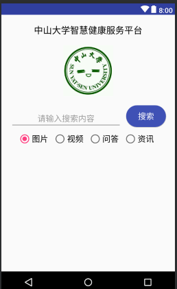

# 中山大学数据科学与计算机学院本科生实验报告
## （2018年秋季学期）
| 课程名称 | 手机平台应用开发 | 任课老师 | 郑贵锋 |
| :------------: | :-------------: | :------------: | :-------------: |
| 年级 | 2016级 | 专业（方向） | 软件工程（电子政务） |
| 学号 | 16340146 | 姓名 | 刘冰清 |
| 电话 | 15989004511 | Email | 1459422733@qq.com |
| 开始日期 | 2018.9.26 | 完成日期 |2018.10.5

---

## 一、实验题目
中山大学智慧健康服务平台应用开发  
第四周任务  基本的UI界面设计 
 
---

## 二、实现内容
实现一个Android应用，界面呈现如图中的效果。  
  
---

## 三、实验结果
### (1)实验截图  
  
### (2)实验步骤以及关键代码
 1. 添加各个组件TextView、EditText、ConstraintLayout、Button、ImageView、RadioGroup、RadioButton  
 2. 设置各个组件的位置和样式
 	TextView：
 	```java
 	<TextView
        android:id="@+id/title"
        android:layout_width="wrap_content"
        android:layout_height="wrap_content"
        android:layout_marginTop="20dp"
        android:text="中山大学智慧健康服务平台"
        android:textColor="#000000"
        android:textSize="20sp"
        app:layout_constraintLeft_toLeftOf="parent"
        app:layout_constraintRight_toRightOf="parent"
        app:layout_constraintTop_toTopOf="parent" />
 	```
 	ImageView
 	```java
 	<ImageView
        android:id="@+id/imageView"
        android:layout_width="wrap_content"
        android:layout_height="wrap_content"
        android:src="@mipmap/sysu"
        app:layout_constraintLeft_toLeftOf="parent"
        app:layout_constraintRight_toRightOf="parent"
        app:layout_constraintTop_toBottomOf="@+id/title"
        android:layout_marginTop="20dp"/>
 	```
 	EditText:
 	```java
 	<EditText
        android:id="@+id/editText"
        android:layout_width="0dp"
        android:layout_height="wrap_content"
        android:layout_marginLeft="20dp"
        android:layout_marginRight="10dp"
        android:layout_marginTop="20dp"
        android:gravity="center"
        android:hint="请输入搜索内容"
        android:textSize="18sp"
        app:layout_constraintBottom_toTopOf="@+id/radioGroup"
        app:layout_constraintLeft_toLeftOf="parent"
        app:layout_constraintRight_toLeftOf="@+id/button"
        app:layout_constraintTop_toBottomOf="@+id/imageView" />
 	```
 	Button
 	```java
 	<Button
        android:id="@+id/button"
        android:layout_width="wrap_content"
        android:layout_height="wrap_content"
        android:background="@drawable/button"
        android:text="搜索"
        android:textColor="#FFFFFF"
        android:textSize="18sp"
        app:layout_constraintLeft_toRightOf="@+id/editText"
        app:layout_constraintRight_toRightOf="parent"
        app:layout_constraintTop_toBottomOf="@+id/imageView"
        app:layout_constraintBottom_toTopOf="@+id/radioGroup"
        android:layout_marginTop="20dp"
        android:layout_marginRight="20dp"/>
 	```
 	RadioGroup和RadioButton 
 	```java
 	<RadioGroup
        android:id="@+id/radioGroup"
        android:layout_width="wrap_content"
        android:layout_height="wrap_content"
        app:layout_constraintTop_toBottomOf="@+id/button"
        android:layout_marginTop="10dp"
        android:orientation="horizontal"
        app:layout_constraintLeft_toLeftOf="parent"
        app:layout_constraintRight_toRightOf="parent">

            <RadioButton
                android:id="@+id/radioButton1"
                android:layout_width="wrap_content"
                android:layout_height="wrap_content"
                android:checked="true"
                android:textSize="18sp"
                android:layout_marginRight="10dp"
                android:text="图片" />
 	```
 3. 修改错误

### (3)实验遇到的困难以及解决思路  
模拟器无法运行的问题。点击在模拟器上运行的时候一直卡在installing apk那个地方，要不就是报错，但是在真机上运行的时候是完全没有问题的。最后新建了另外一个模拟器，在新模拟器上可以正常运行。


---

## 四、实验思考及感想

 1. AS是一项功能强大的IDE，可以帮我们在编辑项目的时候做很多事情
 2. 在发现错误并且无法解决的时候，可以换其他的方式做一下，比如我上面提到的模拟器和真机
 3. 需要多留意课程群里面的消息

---
