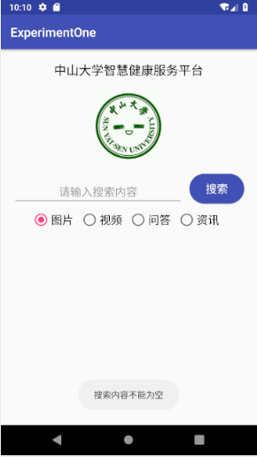
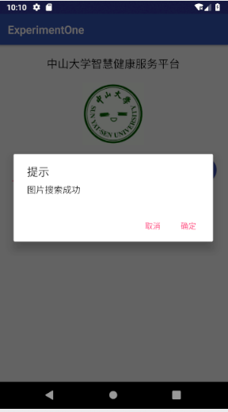
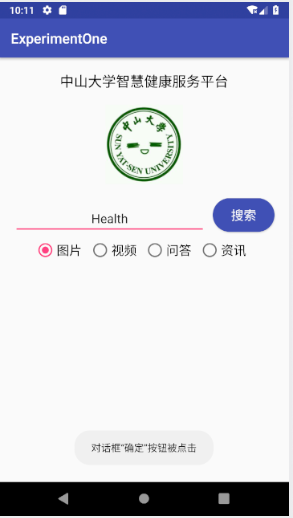
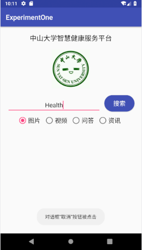
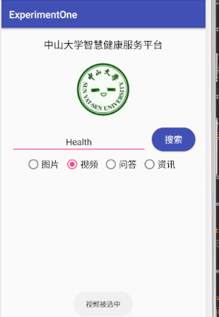
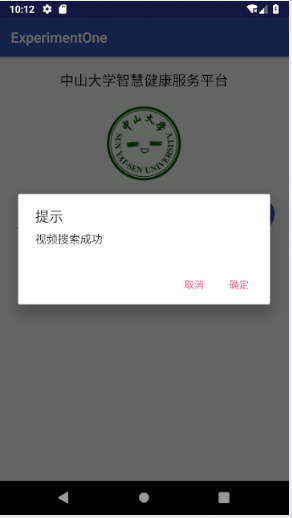
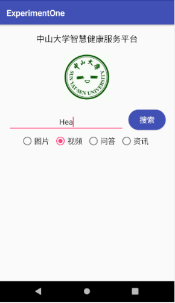
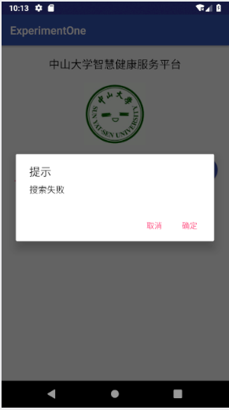

# 中山大学数据科学与计算机学院本科生实验报告
## （2018年秋季学期）
| 课程名称 | 手机平台应用开发 | 任课老师 | 郑贵锋 |
| :------------: | :-------------: | :------------: | :-------------: |
| 年级 | 2016级 | 专业（方向） | 软件工程（电子政务） |
| 学号 | 16340146 | 姓名 | 刘冰清 |
| 电话 | 15989004511 | Email | 1459422733@qq.com |
| 开始日期 | 2018.9.26 | 完成日期 |2018.10.5

---

## 一、实验题目  
实验一 中山大学智慧健康服务平台应用开发  
第五周任务  基础的事件处理

---

## 二、实验内容
实现一个Android应用，界面呈现如图中的效果。  

  
#### 要求  
* 该界面为应用启动后看到的第一个界面。  
* 各控件处理的要求
   1. 点击搜索按钮：
      * 如果搜索内容为空，弹出Toast信息“**搜索内容不能为空**”。
      * 如果搜索内容为“Health”，根据选中的RadioButton项弹出如下对话框。  
  
点击“确定”，弹出Toast信息——**对话框“确定”按钮被点击**。  
点击“取消”，弹出Toast 信息——**对话框“取消”按钮被点击**。  
否则弹出如下对话框，对话框点击效果同上。  
  
   2. RadioButton选择项切换：选择项切换之后，弹出Toast信息“**XX被选中**”，例如从图片切换到视频，弹出Toast信息“**视频被选中**”  

---

## 三、实验结果
### (1)实验截图
  搜索内容为空：  
    
  搜索Health成功：  
  
点击确定：   
  
点击取消：  
  
选择视频：  
  
视频搜索成功：  
  
搜索失败：  
  
  
### (2)实验步骤以及关键代码

 1. 导入button、editText等控件
 ```java
	Button button = (Button)findViewById(R.id.button);
	final EditText editText = (EditText)findViewById(R.id.editText);
 ```
 2. 实现在RadioButton选择项切换时，弹出Toast信息
 ```java
	 radioGroup.setOnCheckedChangeListener(new RadioGroup.OnCheckedChangeListener() {
            @Override
            public void onCheckedChanged(RadioGroup group, int checkedId) {
                if(checkedId == R.id.radioButton1){
                    Toast.makeText(getApplication(), "图片被选中",Toast.LENGTH_SHORT).show();
                    message = "图片搜索成功";
                }
                else if (checkedId == R.id.radioButton2){
                    Toast.makeText(getApplication(), "视频被选中",Toast.LENGTH_SHORT).show();
                    message = "视频搜索成功";
                }
                else if(checkedId == R.id.radioButton3){
                    Toast.makeText(getApplication(), "问答被选中",Toast.LENGTH_SHORT).show();
                    message = "问答搜索成功";
                }
                else{
                    Toast.makeText(getApplication(), "资讯被选中",Toast.LENGTH_SHORT).show();
                    message = "资讯搜索成功";
                }
            }
        });
 ```
 3. 实现在不同搜索内容的条件下，对应的不同对话框或者Toast信息的弹出
 ```java
 button.setOnClickListener(new View.OnClickListener() {
            @Override
            public void onClick(View view) {
                //事件处理
                if(TextUtils.isEmpty(editText.getText().toString()))
                {
                    // 弹出Toast消息
                    Toast.makeText(MainActivity.this, "搜索内容不能为空", Toast.LENGTH_SHORT).show();
                }
                else if(editText.getText().toString().equals("Health"))
                {
                    alertDialog.setMessage(message);
                    alertDialog.show();
                }
                else
                {
                    alertDialog2.show();
                }
            }
        });
 ```
 4. 实现对话框内容的设置及取消、确定按钮的点击事件
 ```java
 	final AlertDialog.Builder alertDialog2 = new AlertDialog.Builder(this);
        alertDialog2.setTitle("提示").setMessage("搜索失败");
        alertDialog2.setPositiveButton("确定", new DialogInterface.OnClickListener(){
            @Override
            public void onClick(DialogInterface dialogInterface,int i) {
                Toast.makeText(getApplication(), "对话框“确定”按钮被点击", Toast.LENGTH_SHORT).show();
            }});
        alertDialog2.setNegativeButton("取消", new DialogInterface.OnClickListener(){
            @Override
            public  void onClick(DialogInterface dialogInterface,int i){
                Toast.makeText(getApplication(), "对话框“取消”按钮被点击", Toast.LENGTH_SHORT).show();
            }});
 ```

  
### (3)实验遇到的困难以及解决思路

 1. 搜索正确的Health时，出现的结果是搜索失败，搜索错误内容时，出现不了对话框。之后发现是在从alertDialog复制alertDialog2并设置内容时，只将第一行的名字改了过来，没有改之后的名字，所以出现了这个错误
 2. RadioButton选择项切换和正确对话框内容的绑定问题。我将对话框的message字符串声明到类里面，这时AS提醒我应该将它声明为final，但是final变量是无法在选项切换的时候给它赋值的，最后发现将它声明为private变量就可以了。

  
---

## 四、实验思考及感想

 1. 多查阅相关文档，学会自学
 2. AS使用十分方便，也会自动提示错误信息
 3. 模拟器使用起来不如真机方便，还会消耗大量电脑内存
 4. 留意课程群的消息，里面会有很多有助于完成作业的信息

---
