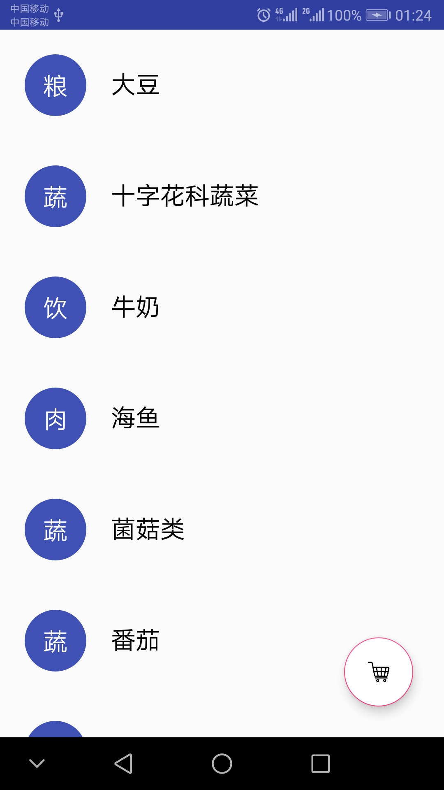
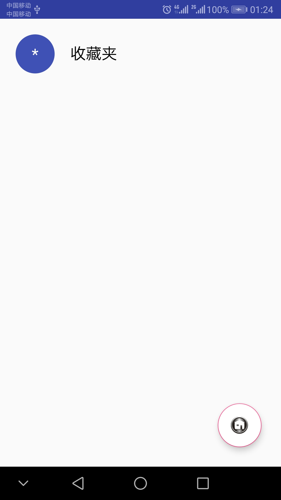
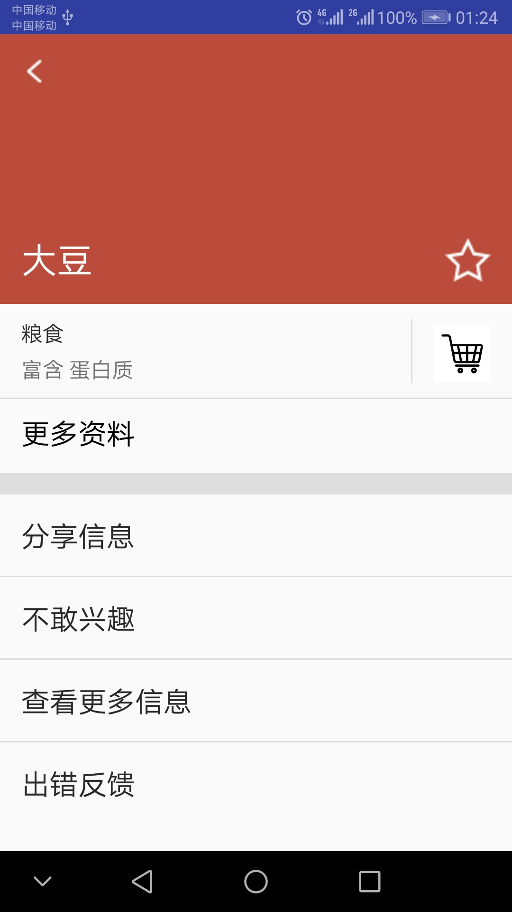
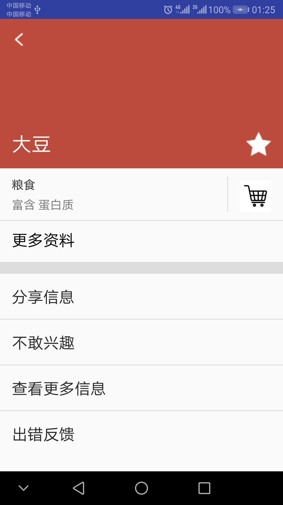
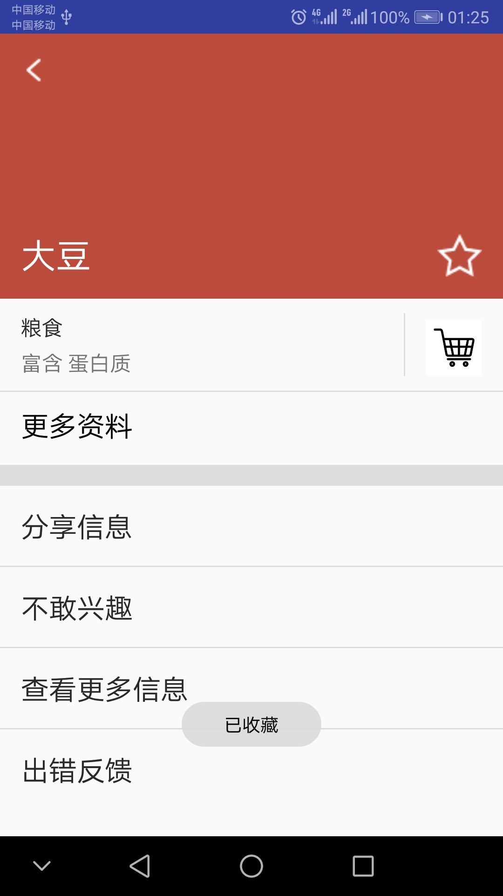
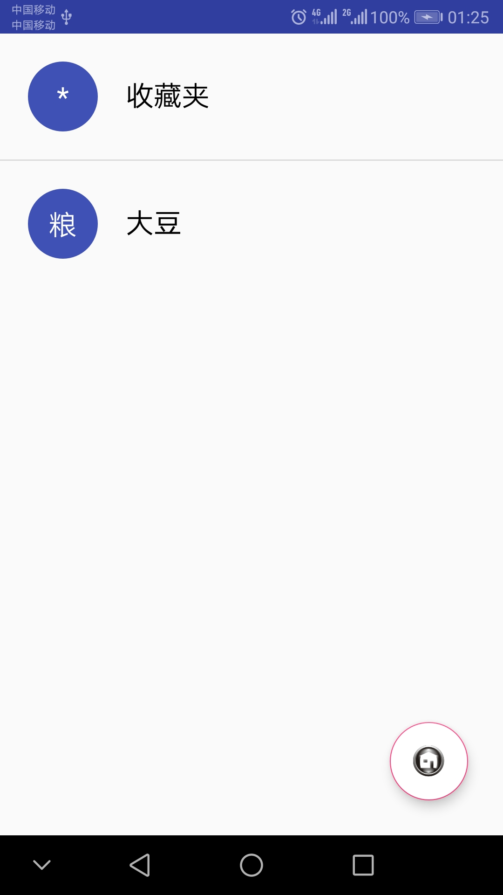
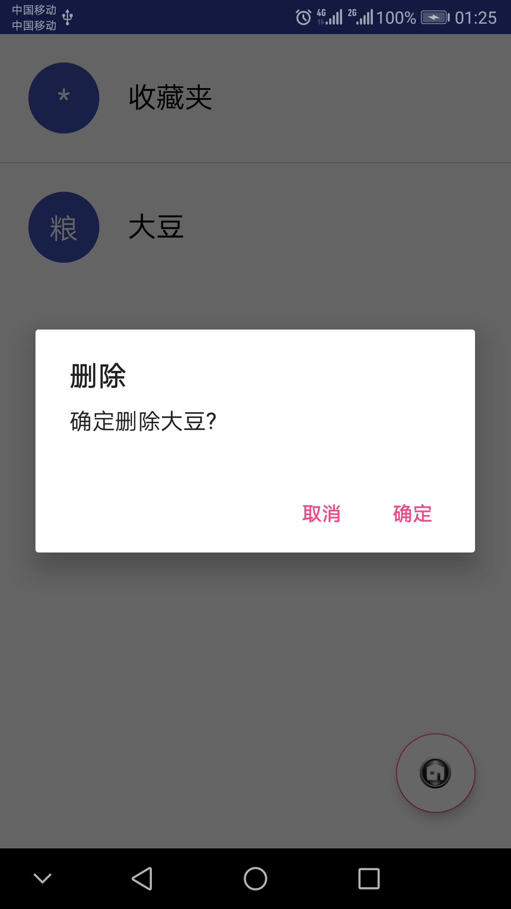
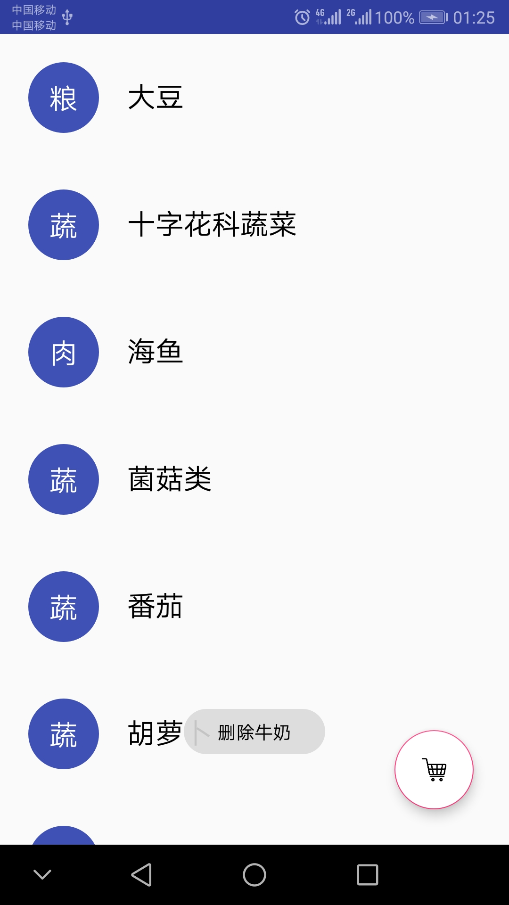

# 中山大学数据科学与计算机学院本科生实验报告
## （2018年秋季学期）
| 课程名称 | 手机平台应用开发 | 任课老师 | 郑贵锋 |
| :------------: | :-------------: | :------------: | :-------------: |
| 年级 | 2016级 | 专业（方向） | 软件工程（电子政务） |
| 学号 | 16340146 | 姓名 | 刘冰清 |
| 电话 | 15989004511 | Email | 1459422733@qq.com |
| 开始日期 | 2018.10.10 | 完成日期 | 2018.10.15

---

## 一、实验题目
实验一  
中山大学智慧健康服务平台应用开发  
第六周任务  
Intent、Bundle的使用以及RecyclerView、ListView的应用

---

## 二、实验内容
本次实验模拟实现一个健康食品列表，有两个界面，第一个界面用于呈现食品列表 如下所示  
  
数据在"manual/素材"目录下给出。  
点击右下方的悬浮按钮可以切换到收藏夹  
   
上面两个列表点击任意一项后，可以看到详细的信息：  
 

#### UI要求  
* 食品列表  
      每一项为一个圆圈和一个名字，圆圈和名字都是垂直居中。圆圈内的内容是该食品的种类，内容要处于圆圈的中心，颜色为白色。食品名字为黑色，圆圈颜色自定义，只需能看见圆圈内的内容即可。
* 收藏夹  
      与食品列表相似
* 食品详情界面  
   1. 界面顶部  
     
   顶部占整个界面的1/3。每个食品详情的顶部颜色在数据中已给出。返回图标处于这块区域的左上角，食品名字处于左下角，星标处于右下角，边距可以自己设置。 **返回图标与名字左对齐，名字与星标底边对齐。** 建议用RelativeLayout实现，以熟悉RelativeLayout的使用。  
   2. 界面中部  
     
   使用的黑色argb编码值为#D5000000，稍微偏灰色的“富含”“蛋白质”的argb编码值为#8A000000。"更多资料"一栏上方有一条分割线，argb编码值为#1E000000。右边收藏符号的左边也有一条分割线，要求与收藏符号高度一致，垂直居中。字体大小自定。"更多资料"下方分割线高度自定。这部分所有的分割线argb编码值都是#1E000000。  
   3. 界面底部  
     
   使用的黑色argb编码值为#D5000000。  
* 标题栏  
      两个界面的标题栏都需要去掉  

#### 功能要求
* 使用RecyclerView实现食品列表。点击某个食品会跳转到该食品的详情界面，呈现该食品的详细信息。长按列表中某个食品会删除该食品，并弹出Toast，提示 **"删除XX"** 。
* 点击右下方的FloatingActionButton，从食品列表切换到收藏夹或从收藏夹切换到食品列表，并且该按钮的图片作出相应改变。
* 使用ListView实现收藏夹。点击收藏夹的某个食品会跳转到食品详情界面，呈现该食品的详细信息。长按收藏夹中的某个食品会弹出对话框询问是否移出该食品，点击确定则移除该食品，点击取消则对话框消失。如长按“鸡蛋”，对话框内容如下图所示。  

* 商品详情界面中点击返回图标会返回上一层。点击星标会切换状态，如果原本是空心星星，则会变成实心星星；原本是实心星星，则会变成空心星星。点击收藏图表则将该食品添加到收藏夹并弹出Toast提示 **"已收藏"** 。

---

## 三、实验结果
### (1)实验截图
食品列表
  

收藏夹
  

食品列表点击大豆，出现详情页面
  

点击星星图标，可在满星和空星之间切换
  

点击收藏图标，弹出toast及添加到收藏夹

  

长按收藏夹中的食品列表弹出删除提示
  

长按食品列表中某个食品，删除该食品并弹出toast
  
  
### (2)实验步骤以及关键代码

 1. 在主界面建立一个RecyclerView用作食品列表，建立相应布局文件
 ```java
    <android.support.v7.widget.RecyclerView
        android:id="@+id/recyclerView"
        android:layout_width="match_parent"
        android:layout_height="wrap_content"

        app:layout_constraintTop_toTopOf="parent"
        app:layout_constraintLeft_toLeftOf="parent"
        app:layout_constraintRight_toRightOf="parent"/>
 ```
 2. 创建MyRecyclerViewAdapter和MyViewHolder类
 3. 将食品列表的数据导入Adapter，并使用Adapter为这个RecyclerView填充数据
  ```java
    public void initdata() {
        recyclelistdata = new ArrayList<>();
        recyclelistdata.add(addRMap("大豆", "粮", "粮食", "蛋白质", "#BB4C3B"));
        recyclelistdata.add(addRMap("十字花科蔬菜", "蔬", "蔬菜", "维生素C", "#C48D30"));
        recyclelistdata.add(addRMap("牛奶", "饮", "饮品", "钙", "#4469B0"));
        recyclelistdata.add(addRMap("海鱼", "肉", "肉食", "蛋白质", "#20A17B"));
        recyclelistdata.add(addRMap("菌菇类", "蔬", "蔬菜", "微量元素", "#BB4C3B"));
        recyclelistdata.add(addRMap("番茄", "蔬", "蔬菜", "番茄红素", "#4469B0"));
        recyclelistdata.add(addRMap("胡萝卜", "蔬", "蔬菜", "胡萝卜素", "#20A17B"));
        recyclelistdata.add(addRMap("荞麦", "粮", "粮食", "膳食纤维", "#BB4C3B"));
        recyclelistdata.add(addRMap("鸡蛋", "杂", "杂", "几乎所有营养物质", "#C48D30"));
    }
 ```  
 ```java
        final RecyclerView recyclerView = (RecyclerView)findViewById(R.id.recyclerView);
        recyclerView.setLayoutManager(new LinearLayoutManager(this));

        final MyRecyclerViewAdapter<Map<String, Object>> myAdapter = new MyRecyclerViewAdapter<Map<String, Object>>(MainActivity.this, R.layout.food_list, recyclelistdata) {
            @Override
            public void convert(MyViewHolder holder, Map<String, Object> s) {
                // Colloction是自定义的一个类，封装了数据信息，也可以直接将数据做成一个Map，那么这里就是Map<String, Object>
                TextView first = holder.getView(R.id.theClass);
                String m = s.get("circle").toString();
                first.setText(m);
                TextView name = holder.getView(R.id.theName);
                String m2 = s.get("name").toString();
                name.setText(m2);
            }
        };
        ScaleInAnimationAdapter animationAdapter = new ScaleInAnimationAdapter(myAdapter);
        animationAdapter.setDuration(1000);
        recyclerView.setAdapter(animationAdapter);
        recyclerView.setItemAnimator(new OvershootInLeftAnimator());
 ```
 4. 在主界面创建一个ListView用作收藏夹，建立相应布局文件
  ```java
    <ListView
        android:layout_width="match_parent"
        android:layout_height="wrap_content"
        android:id="@+id/listView"
        android:visibility="invisible"
        app:layout_constraintTop_toTopOf="parent"
        app:layout_constraintLeft_toLeftOf="parent"
        app:layout_constraintRight_toRightOf="parent" />
 ```
 5. 用SimpleAdapter为ListView填充数据
  ```java
        final ListView listview = (ListView) findViewById(R.id.listView);
        listdata = new ArrayList<>();
        Map<String, Object> temp = new LinkedHashMap<>();
        temp.put("circle","*");
        temp.put("name", "收藏夹");
        temp.put("bgcolor", "");
        temp.put("detail", "");
        temp.put("kind", "");
        listdata.add(temp);
        simpleAdapter = new SimpleAdapter(this, listdata, R.layout.collections_list, new String[]{"circle", "name"}, new int[] {R.id.theClass,R.id.theName});
        listview.setAdapter(simpleAdapter);
 ```
 6. 去掉标题栏
  ```java
      <style name="AppTheme" parent="Theme.AppCompat.Light.NoActionBar">
 ```
 7. 为RecyclerView添加动画
  ```java
        ScaleInAnimationAdapter animationAdapter = new ScaleInAnimationAdapter(myAdapter);
        animationAdapter.setDuration(1000);
        recyclerView.setAdapter(animationAdapter);
        recyclerView.setItemAnimator(new OvershootInLeftAnimator());
 ```
 8. 建立悬浮按钮，使点击按钮时，界面在食品列表和收藏夹之间切换
  ```java
    <android.support.design.widget.FloatingActionButton
        android:id="@+id/btn"
        android:layout_width="wrap_content"
        android:layout_height="wrap_content"
        android:src="@mipmap/collect"
        android:backgroundTint="#FFFFFF"
        android:backgroundTintMode="src_atop"
        app:layout_constraintBottom_toBottomOf="parent"
        app:layout_constraintRight_toRightOf="parent"
        android:layout_margin="25dp" />
 ```
 9. 实现食品列表和收藏夹item的长按的相应删除功能
  ```java
            public void onLongClick(int position) {
                List<Map<String, Object>> temp = myAdapter.getList();
                Toast.makeText(MainActivity.this, "删除"+temp.get(position).get("name").toString(), Toast.LENGTH_SHORT).show();
                myAdapter.remove(position);
            }
 ```
 ```java
        listview.setOnItemLongClickListener(new AdapterView.OnItemLongClickListener() {
            @Override
            public boolean onItemLongClick(AdapterView<?> parent, View view, int position, long id) {
                if (position == 0) return false;
                final int pos = position;

                AlertDialog.Builder dialog = new AlertDialog.Builder(MainActivity.this);
                dialog.setPositiveButton("确定", new DialogInterface.OnClickListener() {
                    @Override
                    public void onClick(DialogInterface dialog, int which) {
                        listdata.remove(pos);
                        simpleAdapter.notifyDataSetChanged();
                        listview.setAdapter(simpleAdapter);
                    }

                });
                dialog.setNegativeButton("取消", new DialogInterface.OnClickListener() {
                    @Override
                    public void onClick(DialogInterface dialog, int which) {

                    }
                });
                dialog.setTitle("删除");
                dialog.setMessage("确定删除" + listdata.get(pos).get("name").toString() + "?");
                dialog.show();
                return true;
            }
        });
 ```
 10. 建立详情页面的布局文件和相应java文件
  ```java
public class DetailActivity extends AppCompatActivity 
 ```
 11. 实现点击食品列表和收藏夹item出现详情页面
  ```java
            public void onClick(int position) {
                List<Map<String, Object>> temp = myAdapter.getList();
                Intent intent = new Intent(MainActivity.this, DetailActivity.class);
                Bundle bundle = new Bundle();
                bundle.putString("name", temp.get(position).get("name").toString());
                bundle.putString("kind", temp.get(position).get("kind").toString());
                bundle.putString("contain", temp.get(position).get("contain").toString());
                bundle.putString("bgcolor", temp.get(position).get("bgcolor").toString());
                bundle.putString("circle", temp.get(position).get("circle").toString());
                intent.putExtras(bundle);
                startActivityForResult(intent, 1);
            }
 ```
 12. 实现返回图标和星星图标的点击事件
  ```java
        star.setOnClickListener(new View.OnClickListener() {
            @Override
            public void onClick(View v) {
                times++;
                if (times%2 == 1) {
                    star.setImageResource(R.drawable.full_star);
                } else {
                    star.setImageResource(R.drawable.empty_star);
                }
            }
        });
        back.setOnClickListener(new View.OnClickListener() {
            @Override
            public void onClick(View v) {
                DetailActivity.this.finish();
            }
        });
 ```
 13.  实现点击收藏图标将食品添加到收藏夹的功能
 ```java
        addshop.setOnClickListener(new View.OnClickListener() {
            @Override
            public void onClick(View v) {
                clickshop = true;
                Toast.makeText(DetailActivity.this,"已收藏",Toast.LENGTH_SHORT).show();
                Intent intent = new Intent(DetailActivity.this, MainActivity.class);
                intent.putExtra("circle", circle);
                intent.putExtra("name", name);
                intent.putExtra("kind", kind);
                intent.putExtra("contain", contain);
                intent.putExtra("bgcolor", bgcolor);
                setResult(1, intent);
            }
        });
 ```
 ```java
    @Override
    protected void onActivityResult(int resquestCode, int resultCode, Intent intentData) {
        super.onActivityResult(resquestCode, resultCode, intentData);
        if (resquestCode == 1) {
            if (resultCode == 1) {
                Map<String, Object> t = new LinkedHashMap<>();
                t.put("circle", intentData.getSerializableExtra("circle"));
                t.put("name", intentData.getSerializableExtra("name"));
                t.put("kind", intentData.getSerializableExtra("kind"));
                t.put("contain", intentData.getSerializableExtra("contain"));
                t.put("bgcolor", intentData.getSerializableExtra("bgcolor"));
                listdata.add(t);
                simpleAdapter.notifyDataSetChanged();
            }
        }
    }
 ```

  
### (3)实验遇到的困难以及解决思路

 1. 找不到相应的R文件。在创建详情页面并布局之后，AS并没有报错，然后编译运行项目，发现所有java文件的R文件都识别不出来了。上网查找了一下这个问题，根据建议修改了一下文件大小限制发现没用，后来发现是详情页面xml文件有问题，我将其它属性当成constraintLayout的属性用了，删除之后就好了。
 2. 食品详情底部的四个操作列表无法正常显示。这个是因为没有仔细看TA给的文档的缘故，漏掉了在使用ArrayAdapter时，**layout只含有一个TextView，其他组件均不可存在，包括ConstraintLayout等布局组件**这个条件所以出了问题。
 3. 详情页面的食品背景颜色的设置问题。一开始打算直接用setBackgroundColor函数，但是发现参数需要int类型，但是我是用string类型传进去的，颜色代码也不方便直接用string转int类型的方法。后面查找到只需将Color.parseColor(bgcolor)当作参数就可以了。
 4. 布局文件中设置的layout_marginBottom没有效果。虽然设置了layout_marginBottom，但由于无法指定控件下方的相关控件，这个属性就一直不能发挥作用，后面直接在xml的design页面设置了一下就行了。
 5. 点击列表后无法出现详情页面。发现一点击item程序就出错闪退，后面查了一下，这是因为没有把消息传递的另一个页面的java文件加入AndroidManifest.xml文件中的缘故。
 6. 收藏图标的大小无法按预期显示。发现虽然设置了width和height，图标的展现也只是截取原图的这个大小的一部分，无法按比例缩放。在课程群里找到了答案，需要设置`android:scaleType="fitXY"`，之后图片就可以呈现出我们需要的大小了。
 7. 收藏食品之后收藏夹没有反应。点击收藏图标之后，已经可以弹出Toast提示食品加入收藏夹了，但是点击收藏夹却无法看到相应食品的列表。后面发现这是忘记在MainActivity.java文件中重写onActivityResult函数的结果。

  
---


## 四、实验思考及感想

 1. 食品详情界面中，顶部占三分之一的实现方法。对于constraintLayout布局，可以使用`app:layout_constraintHeight_percent="0.33"`这个属性，在此之前先将layout_height设置为0。
 2. 在使用AS调试代码时，可以先给代码设置断点，然后一步步执行，这样可以更快更有效地找出出错的地方。
 3. TA的教程和老师的PPT需要仔细阅读，课程群里的消息也应该留意。
 4. 使用RecyclerView和ListView来布局，并用Adapter为其填充数据是一个创建列表的好方法。
 5. 项目要求需要首先考虑，有些地方的要求没有看到的话就只能在后面又重新做。

---
