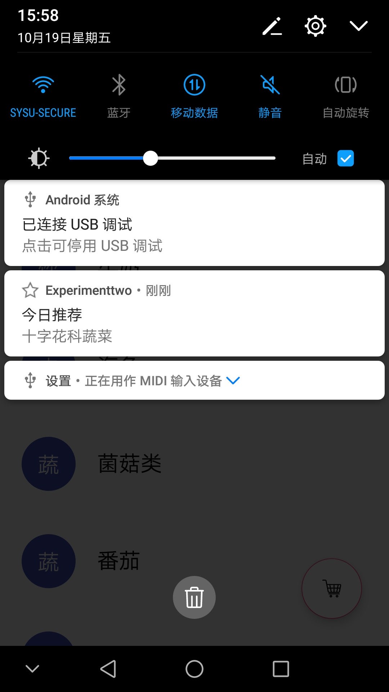
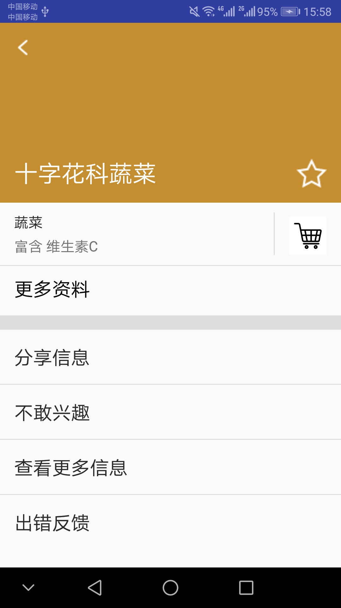
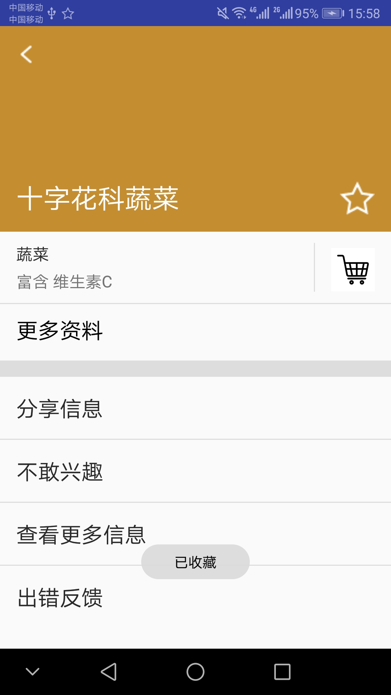
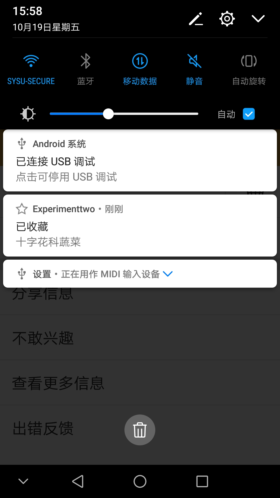
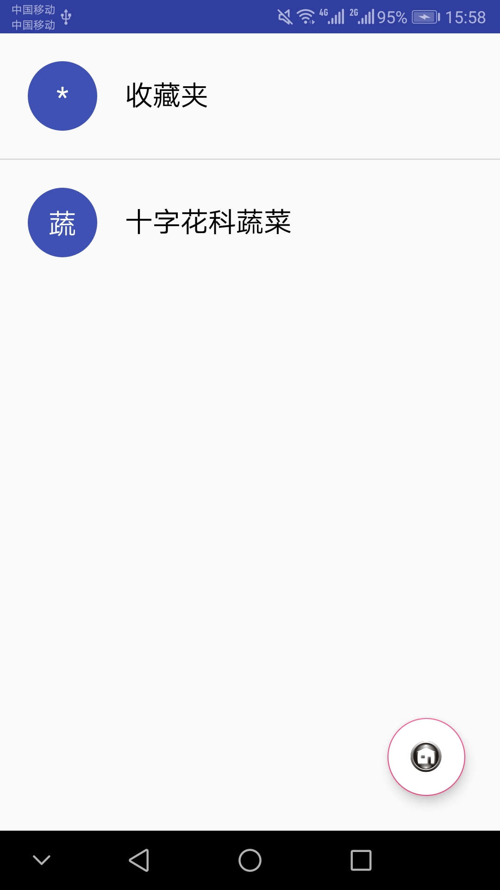
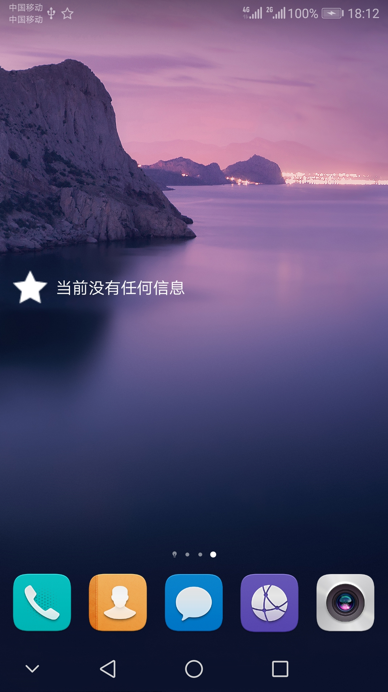
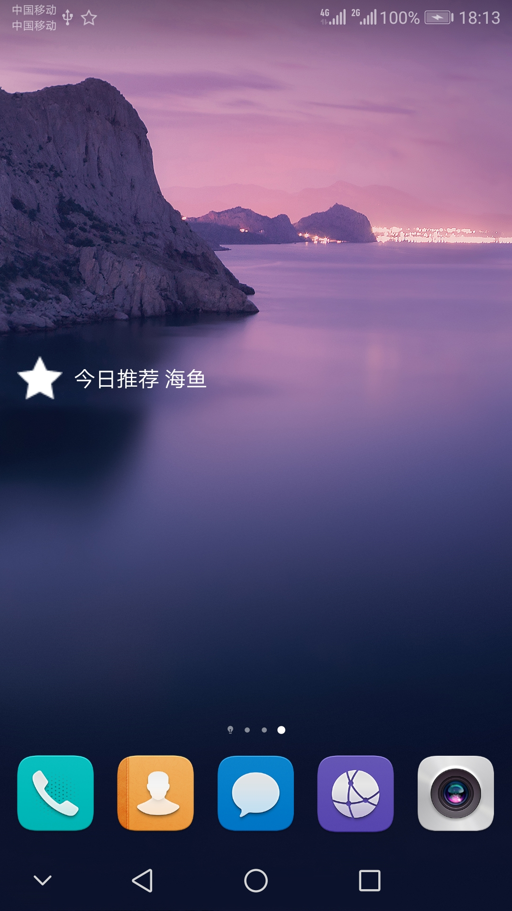
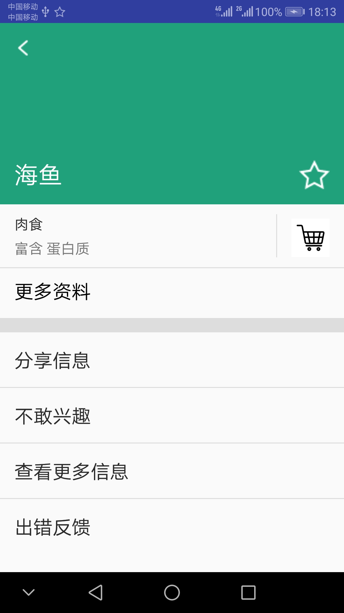
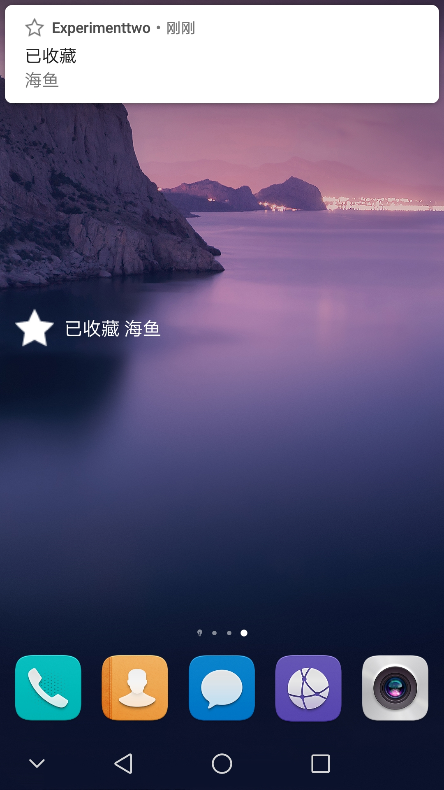
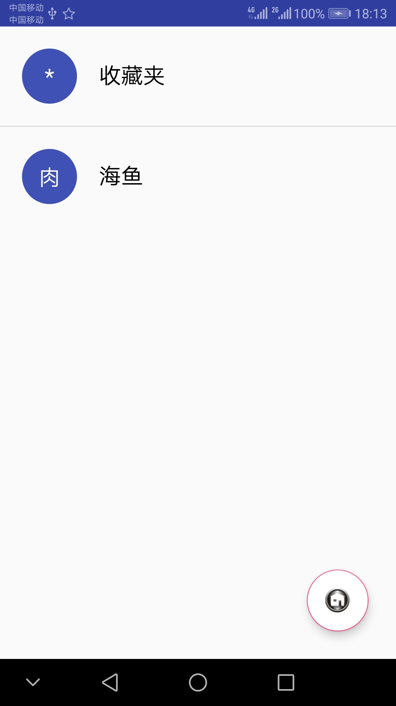

# 中山大学数据科学与计算机学院本科生实验报告
## （2018年秋季学期）
| 课程名称 | 手机平台应用开发 | 任课老师 | 郑贵锋 |
| :------------: | :-------------: | :------------: | :-------------: |
| 年级 | 2016级 | 专业（方向） | 软件工程（电子政务） |
| 学号 | 16340146 | 姓名 | 刘冰清 |
| 电话 | 15989004511| Email | 1459422733@qq.com |
| 开始日期 | 2018.10.17 | 完成日期 | 2018.10.19

---

## 一、实验题目
个人项目2  
中山大学智慧健康服务平台应用开发  
## 第七周任务  
Broadcast 使用  
## 第八周任务  
AppWidget 使用

---

## 二、实现内容
## 第七周：  
在第六周任务的基础上，实现静态广播、动态广播两种改变Notification 内容的方法。  

#### 要求  
* 在启动应用时，会有通知产生，随机推荐一个食品。  
 
* 点击通知跳转到所推荐食品的详情界面。  
  
* 点击收藏图标，会有对应通知产生，并通过Eventbus在收藏列表更新数据。  
  
* 点击通知返回收藏列表。  
  
* 实现方式要求:启动页面的通知由静态广播产生，点击收藏图标的通知由动态广播产生。   

 ## 第八周：  
 在第七周任务的基础上，实现静态广播、动态广播两种改变widget内容的方法。  

#### 要求 
* widget初始情况如下：      
 
* 点击widget可以启动应用，并在widget随机推荐一个食品。      

* 点击widget跳转到所推荐食品的详情界面。     
 
* 点击收藏图标，widget相应更新。     
 
* 点击widget跳转到收藏列表。     
 
* 实现方式要求:启动时的widget更新通过静态广播实现，点击收藏图标时的widget更新通过动态广播实现。

---

## 三、实验结果
## 第七周：  
### (1)实验截图
1. 启动应用，有通知产生，随机推荐一个食品
   

2. 点击通知跳转到所推荐食品的详情界面
  

3. 点击收藏图标，会有对应通知产生，并通过Eventbus在收藏列表更新数据

  

4. 点击通知返回收藏列表

  
### (2)实验步骤以及关键代码
1. 实现静态注册 Broadcast
```java
<receiver android:name=".StaticReceiver"
          android:enabled="true"
          android:exported="true">
          <intent-filter>
              <action android:name="com.example.liubq.experimenttwo.MyStaticFilter" />
          </intent-filter>
      </receiver>
```
```java
public class StaticReceiver extends BroadcastReceiver {
    private static final String STATICACTION = "com.example.liubq.experimenttwo.MyStaticFilter";
    @Override
    public void onReceive(Context context, Intent intent) {
        if (intent.getAction().equals(STATICACTION)){
            Bundle bundle = intent.getExtras();            
              //TODO:添加Notification部分
        }
    }
}
```
2. 使用Notification
```java
PendingIntent pendingIntent = PendingIntent.getActivity(context, 1, intent1, PendingIntent.FLAG_UPDATE_CURRENT);

NotificationChannel channel = new NotificationChannel(CHANNEL_ID, CHANNEL_NAME, NotificationManager.IMPORTANCE_HIGH);
NotificationManager manager = (NotificationManager)context.getSystemService(Context.NOTIFICATION_SERVICE);
manager.createNotificationChannel(channel);

NotificationCompat.Builder mBuilder = new NotificationCompat.Builder(context, CHANNEL_ID)
        .setContentTitle("今日推荐")
        .setContentText(name)
        .setTicker("您有一条新消息")
        .setPriority(Notification.PRIORITY_DEFAULT)
        .setSmallIcon(R.drawable.empty_star)   //设置通知小ICON（通知栏），可以用以前的素材，例如空星
        .setContentIntent(pendingIntent)   //传递内容
        .setAutoCancel(true);   //设置这个标志当用户单击面板就可以让通知将自动取消

Notification notification = mBuilder.build();
manager.notify(1,notification);
```
3. 实现动态注册 Broadcast，Notification部分与静态注册相似
```java
    DynamicReceiver dynamicReceiver = null;

    @Override
    public void onResume(){
        super.onResume();
        IntentFilter dynamic_filter = new IntentFilter();
        dynamic_filter.addAction(DYNAMICACTION);    //添加动态广播的Action
        dynamicReceiver = new DynamicReceiver();
        registerReceiver(dynamicReceiver, dynamic_filter);    //注册自定义动态广播消息
    }

    @Override
    public void onPause(){
        super.onPause();
        unregisterReceiver(dynamicReceiver);
    }
```
4. 用EventBus传递数据
```java
public class MessageEvent { /* Additional fields if needed */
    public String name;
    public String bgcolor;
    public String kind;
    public String contain;
    public String circle;
    MessageEvent(String _name, String _bgcolor, String _kind, String _contain, String _circle){
        name = _name;
        bgcolor = _bgcolor;
        kind = _kind;
        contain = _contain;
        circle = _circle;
    }
}
```
```java
    @Subscribe(threadMode = ThreadMode.MAIN)
    public void onMessageEvent(MessageEvent event) {/* Do something */
        Map<String, Object> t = new LinkedHashMap<>();
        t.put("circle", event.circle);
        t.put("name", event.name);
        t.put("kind", event.kind);
        t.put("contain", event.contain);
        t.put("bgcolor", event.bgcolor);
        listdata.add(t);
        simpleAdapter.notifyDataSetChanged();
        final FloatingActionButton floatingActionButton = (FloatingActionButton) findViewById(R.id.btn);
        final RecyclerView recyclerView = (RecyclerView)findViewById(R.id.recyclerView);
        if(recyclerView.getVisibility() == View.VISIBLE)
        {
            floatingActionButton.callOnClick();
        }
    };
```
  
### (3)实验遇到的困难以及解决思路
1. Android 8.0 和API 26 版本导致的问题。由于我的手机是Android 8.0和API 26版本，所以按照tutorial上面的教程使用Notification是无法发出通知的。我首先按照课程群里面的建议使用了`intentBroadcast.setComponent（new ComponentName(this.getPackageName(), this.getPackageName()+".StaticReceiver")）`函数（引号里面的内容要换成自己的类名）。发现还是无法发出通知，后面经提醒，API 26以上需要使用channel，使用channel之后可正常通知。
2. 点击推荐通知无法转到相应的详情页面。发现每次点击推荐的通知后，转到的都是一个固定的详情页面，而不是推荐的食品所对应的详情页面。之后发现问题出在`PendingIntent.getActivity`这个函数里面，我原本是将它的最后一个flag参数成的0，将它改成`PendingIntent.FLAG_UPDATE_CURRENT`就好了。
3. 点击收藏通知无法转到收藏夹。虽然已经在intent里面设置了点击后跳转到main界面，但是因为这时RecyclerView还是设置的VISIBLE，ListView设置的是INVISIBLE，所以看到的是食品列表界面。于是在`onMessageEvent`函数里面设置当RecyclerView是可见时，使用`floatingActionButton.callOnClick()`函数触发悬浮按钮的点击事件，这时就可以看到收藏夹了。


## 第八周：  
### (1)实验截图  
1. widget初始情况：      
 
2. 点击widget可以启动应用，并在widget随机推荐一个食品:      

3. 点击widget跳转到所推荐食品的详情界面:     
 
4. 点击收藏图标，widget相应更新:     
 
5. 点击widget跳转到收藏列表:     
 
  
### (2)实验步骤以及关键代码  
1. 新建一个NewAppWidget，编辑new_app_widget.xml以及new_app_widget_info.xml文件：
```java
    <ImageView
        android:id="@+id/widget_image"
        android:layout_width="wrap_content"
        android:layout_height="wrap_content"
        android:layout_centerVertical="true"
        android:src="@drawable/full_star"/>

    <TextView
        android:id="@+id/appwidget_text"
        android:layout_width="wrap_content"
        android:layout_height="wrap_content"
        android:layout_centerVertical="true"
        android:layout_margin="8dp"
        android:layout_toEndOf="@id/widget_image"
        android:background="#00000000"
        android:contentDescription="@string/appwidget_text"
        android:text="@string/appwidget_text"
        android:textColor="#ffffff"
        android:textSize="15sp"/>
```
2. 修改NewAppWidget.java 代码，重写 onUpdate 方法：
```java
	@Override
    public void onUpdate(Context context, AppWidgetManager appWidgetManager, int[] appWidgetIds) {
        // There may be multiple widgets active, so update all of them
//        for (int appWidgetId : appWidgetIds) {
//            updateAppWidget(context, appWidgetManager, appWidgetId);
//        }
        super.onUpdate(context, appWidgetManager, appWidgetIds);
        RemoteViews updateView = new RemoteViews(context.getPackageName(), R.layout.new_app_widget);//实例化RemoteView,其对应相应的Widget布局
        Intent i = new Intent(context, MainActivity.class);
        PendingIntent pi = PendingIntent.getActivity(context, 0, i, PendingIntent.FLAG_UPDATE_CURRENT);
        updateView.setOnClickPendingIntent(R.id.widget_image, pi); //设置点击事件
        ComponentName me = new ComponentName(context, NewAppWidget.class);
        appWidgetManager.updateAppWidget(me, updateView);
    }
```
3. 注册静态广播，在NewAppWidget.java 文件的Widget 类中重写onReceive 方法：
```java
    @Override
    public void onReceive(Context context, Intent intent ){
        super.onReceive(context, intent);
        AppWidgetManager appWidgetManager = AppWidgetManager.getInstance(context);
        Bundle bundle = intent.getExtras();
        if(intent.getAction().equals("android.appwidget.action.APPWIDGET_UPDATE") && bundle.getSerializable("name") != null){
            RemoteViews views = new RemoteViews(context.getPackageName(), R.layout.new_app_widget);
            CharSequence widgetText = "今日推荐 "+ bundle.getString("name");
            views.setTextViewText(R.id.appwidget_text, widgetText);

            Intent intent2 = new Intent(context, DetailActivity.class);
            Bundle bundle2 = new Bundle();
            bundle2.putString("name", bundle.getString("name"));
            bundle2.putString("kind", bundle.getString("kind"));
            bundle2.putString("contain", bundle.getString("contain"));
            bundle2.putString("bgcolor", bundle.getString("bgcolor"));
            bundle2.putString("circle", bundle.getString("circle"));
            intent2.putExtras(bundle2);

            PendingIntent pendingIntent=PendingIntent.getActivity(context,0, intent2, PendingIntent.FLAG_UPDATE_CURRENT);
            views.setOnClickPendingIntent(R.id.appwidget_text,pendingIntent);
            ComponentName me=new ComponentName(context,NewAppWidget.class);
            appWidgetManager.updateAppWidget(me, views);
        }
    }
```
4. 重写主界面中的onRestart方法，发送静态广播：
```java
    @Override
    protected void onRestart() {
        super.onRestart();
        Intent widgetIntentBroadcast = new Intent("android.appwidget.action.APPWIDGET_UPDATE");
//        widgetIntentBroadcast.setComponent(new ComponentName(this.getPackageName(), this.getPackageName()+".MyWidgetStaticFilter"));
        Random random = new Random();
        int n = random.nextInt(9); //返回一个0到n-1的整数
        Bundle bundle = new Bundle();
        bundle.putString("name", recyclelistdata.get(n).get("name").toString());
        bundle.putString("kind", recyclelistdata.get(n).get("kind").toString());
        bundle.putString("contain", recyclelistdata.get(n).get("contain").toString());
        bundle.putString("bgcolor", recyclelistdata.get(n).get("bgcolor").toString());
        bundle.putString("circle", recyclelistdata.get(n).get("circle").toString());
        widgetIntentBroadcast.putExtras(bundle);
        sendBroadcast(widgetIntentBroadcast);
    }
```
5. 在DynamicReceiver中添加接收动态广播后更新Widget：
```java
            RemoteViews views = new RemoteViews(context.getPackageName(), R.layout.new_app_widget);
            CharSequence widgetText = "已收藏 "+ bundle.getString("name");
            views.setTextViewText(R.id.appwidget_text, widgetText);
            ComponentName me = new ComponentName(context, NewAppWidget.class);
            AppWidgetManager appWidgetManager = AppWidgetManager.getInstance(context);
            appWidgetManager.updateAppWidget(me, views);
```
  
### (3)实验遇到的困难以及解决思路
1. Widget无法添加到桌面。将Widget长按添加到桌面后，手机就一直闪，并且关机重启之后还一直闪。本来以为是手机坏了，后来发现删掉这个应用就恢复正常。之后用模拟器试了一下，也提示不能用，最后发现是new_app_widget.xml中代码的问题，改过来就可以了。
2. NewAppWidget.java 中的onReceive 方法无法接到静态广播。设置断点调试，发现主界面的onRestart方法是可以正常调用的。本来以为是和上周一样的版本问题，但是使用setComponent函数之后仍然无法接收静态广播。之后发现将intent的action由`"com.example.liubq.experimenttwo.MyWidgetStaticFilter"`改成`"android.appwidget.action.APPWIDGET_UPDATE"`就可以了
  
---

## 四、实验思考及感想
## 第七周：  
1. Broadcast的使用在Android 8.0 和API 26 以上版本有较大的改变。
2. 函数的参数要弄明白意思和正确使用方法。
3. 在使用AS调试代码查找bug时，可以先给代码设置断点，然后一步步执行，这样可以快且有效地找出出错的地方。
4. TA的教程和老师的PPT需要仔细阅读，课程群里的消息也应该留意。
5. 本来以为模拟器的API版本会低一点，没想到更高。
## 第八周：  
1. 当项目编译运行时IDE没有代码报错，但是应用运行时却遇到莫名其妙找不到源头的错误时，应多注意xml文件。xml文件在很多情况下，代码不正确却不会报错。
2. 断点调试的方式可以较为快速和准且地找到问题所在的地方，AS的断点debug功能十分强大且方便。
3. Widget的使用中，掌握使用RemoteViews来调用程序界面的方式十分重要。

---
