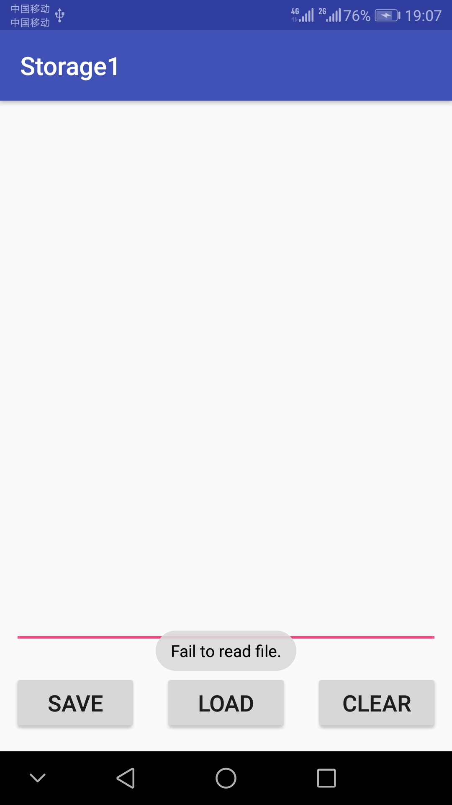
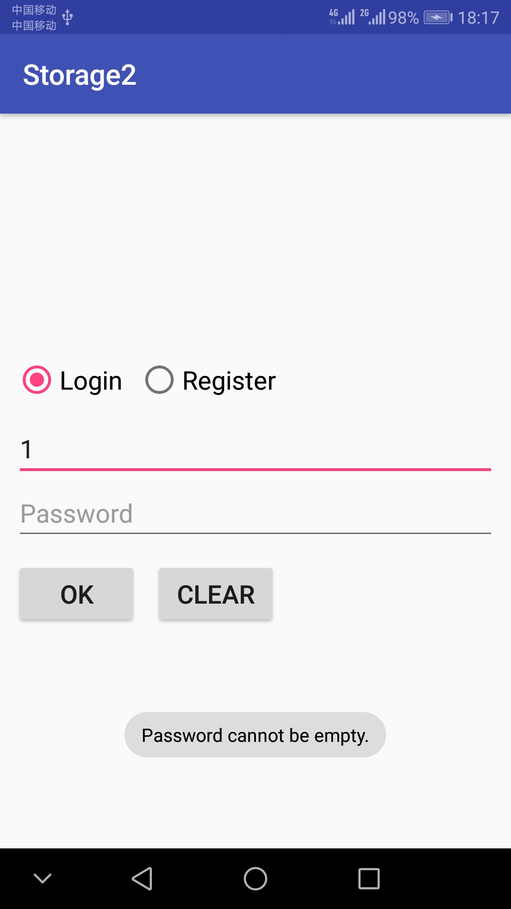

# 中山大学数据科学与计算机学院本科生实验报告
## （2018年秋季学期）
| 课程名称 | 手机平台应用开发 | 任课老师 | 郑贵锋 |
| :------------: | :-------------: | :------------: | :-------------: |
| 年级 | 2016级 | 专业（方向） | 软件工程（电子政务） |
| 学号 | 16340146 | 姓名 | 刘冰清 |
| 电话 | 15989004511 | Email | 1459422733@qq.com |
| 开始日期 | 2018.10.31 | 完成日期 | 2018.11.8

---

## 一、实验题目
### 个人项目3  数据存储应用开发
## 第九周：
第九周任务  数据存储（一）

## 第十一周：  
第十一周任务  数据存储（二）

---

## 二、实现内容

## 第九周：

#### 要求  
* Figure 1：首次进入，呈现创建密码界面。  
 
* Figure 2：若密码不匹配，弹出Toast提示。  
  
* Figure 3：若密码为空，弹出Toast提示。  
  
* Figure 4：退出后第二次进入呈现输入密码界面。  
  
* Figure 5：若密码不正确，弹出Toast提示。  
 
* Figure 6：文件加载失败，弹出Toast提示。  
  
* Figure 7：成功保存文件，弹出Toast提示。  
  
* Figure 8：成功导入文件，弹出Toast提示。  
  
###
1.  如Figure 1至Figure 8所示，本次实验演示应用包含两个Activity。 
2.  首先是密码输入Activity：
    * 若应用首次启动，则界面呈现出两个输入框，分别为新密码输入框和确认密码输入框。  
    * 输入框下方有两个按钮：  
        - OK按钮点击后：  
            + 若New Password为空，则发出Toast提示。见Figure 3。
            + 若New Password与Confirm Password不匹配，则发出Toast提示，见Figure 2。
            + 若两密码匹配，则保存此密码，并进入文件编辑Activity。
        - CLEAR按钮点击后：清楚两输入框的内容。  
    * 完成创建密码后，退出应用再进入应用，则只呈现一个密码输入框，见Figure 4。
        - 点击OK按钮后，若输入的密码与之前的密码不匹配，则弹出Toast提示，见Figure 5。
        - 点击CLEAR按钮后，清除密码输入框的内容。
    * **出于演示和学习的目的，本次实验我们使用SharedPreferences来保存密码。但实际应用中不会使用这种方式来存储敏感信息，而是采用更安全的机制。见[这里](http://stackoverflow.com/questions/1925486/android-storing-username-and-password)和[这里](http://stackoverflow.com/questions/785973/what-is-the-most-appropriate-way-to-store-user-settings-in-android-application/786588)。**
3.  文件编辑Activity：
    * 界面底部有三个按钮，高度一致，顶对齐，按钮水平均匀分布，三个按钮上方除ActionBar和StatusBar之外的全部空间由一个EditText占据（保留margin）。EditText内的文字竖直方向置顶，左对齐。
    * 在编辑区域输入任意内容，点击SAVE按钮后能保存到指定文件（文件名随意）。成功保存后，弹出Toast提示，见Figure 8。
    * 点击CLEAR按钮，能清空编辑区域的内容。
    * 点击LOAD按钮，能够从同一文件导入内容，并显示到编辑框中。若成功导入，则弹出Toast提示。见Figure 7.若读取文件过程中出现异常（如文件不存在），则弹出Toast提示。见Figure 6.
4.  特殊要求：进入文件编辑Activity后，若点击返回按钮，则直接返回Home界面，不再返回密码输入Activity。


## 第十一周：
实现一个评论应用，本次实验虽然号称是（二），但是和（一）无法合并到同一个项目当中，因此本实验应当新建一个项目，而不是在（一）的基础上继续开发。

#### 要求  


<table>
    <tr>
        <td >点击Login切换到登录界面</td>
        <td >图1.2 若Username为空，则发出Toast提示</td>
    </tr>
    <tr>
        <td>图1.3 若Password为空，则发出Toast提示</td>
        <td >图1.4 若Username不存在，则发出Toast提示 </td>
    </tr>
    <tr>
        <td> 图1.5 若密码不正确，则发出Toast提示</td>
        <td></td>
    </tr>
    <tr>
        <td>图2.1 点击Register切换到注册页面</td>
        <td >图2.2 若Username为空，则发出Toast提示 </td>
    </tr>
    <tr>
        <td>图2.3 若New Password为空，则发出Toast提示</td>
        <td >图2.4 若New Password与Confirm Password不匹配，则发出Toast提示 </td>
    </tr>
    <tr>
        <td>图2.5 若Username已经存在，则发出Toast提示</td>
        <td > </td>
    </tr>  
    <tr>
        <td>图3.1 评论页面</td>
        <td >图3.2 若EditText为空，则发出Toast提示 </td>
    </tr>  
    <tr>
        <td>图3.3 短按评论：弹出对话框，显示该评论的用户以及通讯录中该用户的电话号码</td>
        <td >图3.4 短按评论：弹出对话框，显示该评论的用户以及通讯录中该用户的电话号码 </td>
    </tr>  
    <tr>
        <td>图3.5 弹出是否删除的对话框</td>
        <td >图3.6 弹出是否举报的对话框 </td>
    </tr>  
    <tr>
        <td>图4.1 进入手机图库进行图片选择</td>
        <td >图4.2 ImageView显示本次选择的图片 </td>
    </tr>  
    <tr>
        <td>图4.3 在评论页面，每条Item应当正确显示用户的头像</td>
        <td > </td>
    </tr>  
</table>

* #### 技术要求： 
    1. 使用SQLite数据库保存用户的相关信息和评论的相关信息，使得每次运行程序都可以使用数据库进行用户的登陆与注册，以及显示数据库中的评论；
    2. 使用ContentProvider来获取对应用户的电话号码；
* #### 功能要求：  
    1. 如图1至图8所示，本次实验演示应包含2个Activity。
    2. 首页Activity包含登录功能和注册功能，通过radioButton在两个页面进行切换,在登陆界面输入正确的用户名和密码后跳转到评论页面。
    3. 评论Activity,界面由ListView、EditText和Button组成，ListView中展示数据库中保存的评论信息，在EditText写评论，点击Send按钮发送评论。
    4. 首页Activity：
        * 应用启动时，界面初始化为登录界面，通过Login和Register两个RadioButton进行登录与注册之间的切换。
        * 点击Login切换到登录界面（见图1.1），可以保留注册界面时的Username，但不保存密码：
            - OK按钮点击后：
                + 若Username为空，则发出Toast提示。见图1.2.
                + 若Password为空，则发出Toast提示。见图1.3.
                + 若Username不存在，则发出Toast提示。见图1.4.
                + 若密码不正确，则发出Toast提示。见图1.5.
            - CLEAR按钮点击后：清除两个输入框的内容。
        * 点击Register切换到注册页面（见图2.1），可以保留登录界面时的Username，但不保存密码，在输入框和RadioButto之间存在一个头像ImageView，水平居中：
            - OK按钮点击后：
                + 若Username为空，则发出Toast提示。见图2.2.
                + 若New Password为空，则发出Toast提示。见图2.3.
                + 若New Password与Confirm Password不匹配，则发出Toast提示。见图2.4.
                + 若Username已经存在，则发出Toast提示。见图2.5. 
            - CLEAR按钮点击后：清除三个输入框的内容。
    5. 评论页面：
        * 界面底部有一个EditText和一个按钮，高度一致，EditText占据按钮左边的全部空间。上方的全部剩余空间由一个ListView占据（保留margin）。见图3.1.
        * ListView中的每条Item，包含了头像、点赞按钮这两个ImageView和用户名、评论时间、评论内容、点赞数这4个TextView。
            - 用户名、评论时间、评论内容在头像的右边。
            - 点赞按钮在Item的最右边，而且在用户名+评论时间的总高度上处于竖直方向上居中，**注意：总高度不包括评论占据的高度**
            - 点赞数在点赞按钮的左边，竖直方向居中要求同点赞按钮。
            - **以下样式供参考，不做强制要求，但要求至少美观：**
                + Item整体margin：10dp，
                + 头像width、hight：40sp，
                + 用户名textColor：#7a7a7a、textSize：20sp
                + 评论时间textColor：#7a7a7a、textSize：10sp
                + 评论textColor：#3e3e3e、textSize：20sp
                + 点赞数textSize：15sp 
        * 点击EditText写评论
        * 点击Send按钮发送评论
            - 若EditText为空，则发出Toast提示。如图3.2.
            - 若EditText不为空，则发送评论，在数据库和ListView中添加新评论。
        * ListView中的Item点击事件：
            - 短按评论：弹出对话框，显示该评论的用户以及通讯录中该用户的电话号码。如图3.3和图3.4.
            - 长按评论：
                + 若该评论为当前用户发送的，弹出是否删除的对话框,若选择了Yes，则删除该条评论并更新数据库和ListView。如图3.5.
                + 若该评论不为当前用户发送的，弹出是否举报的对话框，若选择了Yes，则弹出Toast提示，不需做任何数据库和ListView的更改。如图3.6.

    **附加内容（加分项，本次实验与（一）合计100分，加分项每项占10分）**
    
    1. **头像**
        在用户注册页面可以选择用户头像，ImageView初始化为图add，如图2.1。点击ImageView，进入手机图库进行图片选择。如图4.1.
        * 如果正确选择了一张图片，则ImageView显示本次选择的图片。如图4.2.
        * 如果没有正确选择图片（如在图片选择页面点击了取消或按了手机的BACK键），则ImageView保留本次点击事件发生前的状态，如初始的＋号图片，如图4.1，或者是上一个被正确选择的图像。如图4.2.
        在评论页面，每条Item应当正确显示用户的头像，如果用户没有在注册页面选择头像，则使用默认头像。如图4.3.
    2. **点赞**
    在评论界面，点赞按钮可以被点击，点赞数可以正常统计，用户点赞状态可以被正常记录，白色的未点赞状态经用户点击后变为红色的点赞状态，点赞数加1；再次点击点赞按钮可取消点赞，点赞数减1.要求用数据库记录点赞的信息，使得应用重启后用户的点赞状态，评论的点赞数可以正常显示，注意：用户的对每条评论的点赞状态是唯一的，即不同用户对每条评论的点赞状态应当分开记录，同一用户对不同评论的点赞状态也应当分开记录。同理，每条评论的点赞数也应当分开记录。请参考demo自行体会。

    **对附加内容的补充（不想做加分项的看这里）**

    1. **头像**
        在用户注册页面的ImageView显示为默认头像，且不需要添加任何的点击事件监听器，在评论页面的用户头像也使用默认头像。
    2. **点赞**
        不需要为点赞按钮添加点击事件监听器，关于点赞状态和点赞数使用随机数进行生成即可，也不要求用数据库记录点赞状态和点赞数。  

    3. **虽然点击事件的逻辑可以不做，但是界面的样式是必须按照前文做的！**

 
---

## 三、实验结果
## 第九周：
### (1)实验截图
1. 首次进入，呈现创建密码界面
  
 
2. 若密码不匹配，弹出Toast提示
 

3. 按CLEAR清空
 
  
4. 若密码为空，弹出Toast提示 
  

5. 文件编辑界面  
 
  
6. 退出后第二次进入呈现输入密码界面  
 
  
7. 若密码不正确，弹出Toast提示  
 
 
8. 文件加载失败，弹出Toast提示  
 
  
9. 成功保存文件，弹出Toast提示  
 
  
10. 成功导入文件，弹出Toast提示  
 
 
  
### (2)实验步骤以及关键代码
1. 实现登录界面的UI
```java
    <EditText
        android:id="@+id/newp"
        android:layout_width="0dp"
        android:layout_height="wrap_content"
        android:layout_marginLeft="10dp"
        android:layout_marginRight="10dp"
        android:layout_marginBottom="10dp"
        android:hint="New Password"
        android:inputType="textPassword"
        android:textSize="18sp"
        app:layout_constraintBottom_toTopOf="@id/conp"
        app:layout_constraintLeft_toLeftOf="parent"
        app:layout_constraintRight_toRightOf="parent"/>

    <EditText
        android:id="@+id/conp"
        android:layout_width="0dp"
        android:layout_height="wrap_content"
        android:layout_marginLeft="10dp"
        android:layout_marginRight="10dp"
        android:hint="Confirm Password"
        android:inputType="textPassword"
        android:textSize="18sp"
        app:layout_constraintBottom_toBottomOf="parent"
        app:layout_constraintLeft_toLeftOf="parent"
        app:layout_constraintRight_toRightOf="parent"
        app:layout_constraintTop_toTopOf="parent" />
```
```java
    <Button
        android:id="@+id/ok"
        android:layout_width="wrap_content"
        android:layout_height="wrap_content"
        android:text="OK"
        android:textSize="18sp"
        app:layout_constraintLeft_toLeftOf="parent"
        app:layout_constraintTop_toBottomOf="@id/conp"
        android:layout_marginLeft="10dp"
        android:layout_marginTop="20dp"/>
```
2. 实现点击OK按钮和CLEAR按钮的功能
```java
        ok.setOnClickListener(new View.OnClickListener() {
            @Override
            public void onClick(View view) {
                if(flag)
                {
                    if(TextUtils.isEmpty(newp.getText().toString()))
                    {
                        Toast.makeText(MainActivity.this, "Password cannot be empty.", Toast.LENGTH_SHORT).show();
                    }
                    else if(newp.getText().toString().equals(conp.getText().toString()))
                    {
                        SharedPreferences.Editor editor = sharedPref.edit();
                        editor.putString("password", conp.getText().toString());
                        editor.commit();

                        Intent intent = new Intent(MainActivity.this, FileEditorActivity.class);
                        startActivityForResult(intent, 1);
                    }
                    else
                    {
                        Toast.makeText(MainActivity.this, "Password Mismatch.", Toast.LENGTH_SHORT).show();
                    }
                }
```
```java
        clear.setOnClickListener(new View.OnClickListener() {
            @Override
            public void onClick(View view) {
                newp.setText("");
                conp.setText("");
            }
        });
```
3. 实现退出后第二次进入呈现输入密码界面的功能
```java
        final SharedPreferences sharedPref = getSharedPreferences("MY_PREFERENCE", Context.MODE_PRIVATE);
        String password = sharedPref.getString("password","defValue");
        if(password.equals("defValue"))
        {

        }
        else
        {
            flag = false;
            newp.setVisibility(View.GONE);
            conp.setHint("Password");
        }
```
4. 实现文件编辑界面的UI
```java
    <LinearLayout
        android:id="@+id/text"
        android:layout_width="match_parent"
        android:layout_height="0dp"
        android:orientation="vertical"
        app:layout_constraintHeight_percent="0.85"
        app:layout_constraintVertical_bias="0"
        app:layout_constraintBottom_toTopOf="@id/btn"
        app:layout_constraintLeft_toLeftOf="parent"
        app:layout_constraintRight_toRightOf="parent"
        app:layout_constraintTop_toTopOf="parent">

        <EditText
            android:id="@+id/editText"
            android:layout_width="match_parent"
            android:layout_height="wrap_content"
            android:layout_marginLeft="10dp"
            android:layout_marginRight="10dp"
            android:layout_marginTop="10dp"
            android:layout_weight="1"
            android:gravity="top" />
    </LinearLayout>

    <LinearLayout
        android:id="@+id/btn"
        android:layout_width="match_parent"
        android:layout_height="wrap_content"
        android:orientation="horizontal"
        android:layout_marginBottom="20dp"
        android:layout_marginLeft="10dp"
        android:layout_marginRight="10dp"
        android:layout_marginTop="20dp"
        app:layout_constraintLeft_toLeftOf="parent"
        app:layout_constraintRight_toRightOf="parent"
        app:layout_constraintTop_toBottomOf="@id/text"
        app:layout_constraintBottom_toBottomOf="parent">
        <Button
            android:id="@+id/save"
            android:layout_width="wrap_content"
            android:layout_height="wrap_content"
            android:text="SAVE"
            android:textSize="18sp"
            android:layout_marginRight="20dp"
            android:layout_weight="1"/>
```
5. 实现SAVE按钮、LOAD按钮、CLEAR按钮的功能
```java
        save.setOnClickListener(new View.OnClickListener() {
            @Override
            public void onClick(View view) {
                try (FileOutputStream fileOutputStream = openFileOutput("MY_PREFERENCE", MODE_PRIVATE)) {
                    String str = editText.getText().toString();
                    fileOutputStream.write(str.getBytes());

                    Toast.makeText(FileEditorActivity.this, "Save successfully", Toast.LENGTH_SHORT).show();
                    Log.i("TAG", "Successfully saved file.");
                } catch (IOException ex) {
                    Log.e("TAG", "Fail to save file.");
                }
            }
        });

        load.setOnClickListener(new View.OnClickListener() {
            @Override
            public void onClick(View view) {
                try (FileInputStream fileInputStream = openFileInput("MY_PREFERENCE")) {
                    byte[] contents = new byte[fileInputStream.available()];
                    fileInputStream.read(contents);
                    String str = new String(contents,"UTF-8");
                    editText.setText(str);

                    Toast.makeText(FileEditorActivity.this, "Load successfully", Toast.LENGTH_SHORT).show();
                } catch (IOException ex) {
                    Toast.makeText(FileEditorActivity.this, "Fail to read file.", Toast.LENGTH_SHORT).show();
                    Log.e("TAG", "Fail to read file.");
                }
            }
        });

        clear1.setOnClickListener(new View.OnClickListener() {
            @Override
            public void onClick(View view) {
                editText.setText("");
            }
        });
```
6. 实现页面跳转
```java
                else
                {
                    if(sharedPref.getString("password","defValue").equals(conp.getText().toString())){
                        Intent intent = new Intent();
                        intent.setClass(MainActivity.this,FileEditorActivity.class);
                        startActivityForResult(intent, 1);
                    }
                    else
                    {
                        Toast.makeText(MainActivity.this, "Invalid Password", Toast.LENGTH_SHORT).show();
                    }
                }
```
7. 实现进入文件编辑Activity后，若点击返回按钮，则直接返回Home界面的功能
```java
    @Override
    public boolean onKeyDown(int keyCode, KeyEvent event) {
        if (keyCode == KeyEvent.KEYCODE_BACK) {
            Intent intent = new Intent(FileEditorActivity.this,MainActivity.class);
            startActivity(intent);
        }
        return super.onKeyDown(keyCode, event);
    }
```
```java
    @Override
    protected void onNewIntent(Intent intent) {
        finish();
    }
```
  
### (3)实验遇到的困难以及解决思路
1. 页面无法跳转的问题。无论是第一次进入程序跳转到文件编辑页面，还是第二次进入程序后跳转到文件编辑页面，都无法实现。本来以为是跳转方式的问题，后来发现是忘记在AndroidManifest.xml中注册FileEditorActivity。
2. 文件编辑界面的布局问题。主要是三个按钮的平均布局和按钮与文本编辑界面的页面占比问题。将整个界面分成两个LinearLayout，文本编辑界面占一个，三个按钮占一个。调整两个布局的占比大小即可。将三个按钮设置成相同的layout_weight即可使它们均匀分布。
3. 实现进入文件编辑Activity后，若点击返回按钮，则直接返回Home界面的功能。如果不做任何事情，在进入文件编辑Activity后，点击返回按钮会返回密码输入界面。需将MainActivity的launchMode设置成singleTask，然后在文件编辑界面的返回按钮点击后传递一个intent，即可在MainActivity的onNewIntent函数里面直接调用finish函数结束应用。  


## 第十一周
### (1)实验截图
 - 登录界面
 	1. 用户名为空  
 
 	2. 密码为空 
 
 	3. 用户不存在 
 
 	4. 密码不正确 
 
 	5. 按CLEAR键清空 
 
- 注册界面
	1. 用户名为空 
 
	2. 密码为空 
 
	3. 密码不匹配 
 
	4. 用户已经存在 
 
	5. 注册成功 
 
	6. 带图片注册成功 
 
- 评论界面
	1. 评论初始界面 
 
	2. 添加评论 
 
	3. 保存点赞状态和点赞数 
 
	4. 取消点赞 
 
	5. 短按显示用户名和电话号码，号码不存在通讯录 
 
	6. 短按显示用户名和电话号码，号码存在通讯录 
 
	7. 长按评论，该评论不是当前用户发送，是否举报
 
	8. 点击YES举报
 
	9. 长按评论，该评论是当前用户发送，是否删除
 
	10.  点击YES删除
 
### (2)实验步骤以及关键代码
1. 新建项目，设置主界面UI
```java
    <ImageView
        android:id="@+id/picture"
        android:layout_width="100dp"
        android:layout_height="100dp"
        android:src="@mipmap/add"
        android:layout_marginBottom="10dp"
        app:layout_constraintBottom_toTopOf="@id/username"
        app:layout_constraintLeft_toLeftOf="parent"
        app:layout_constraintRight_toRightOf="parent"/>

    <EditText
        android:id="@+id/username"
        android:layout_width="0dp"
        android:layout_height="wrap_content"
        android:layout_marginLeft="10dp"
        android:layout_marginRight="10dp"
        android:hint="Username"
        android:textSize="18sp"
        app:layout_constraintBottom_toTopOf="@id/newp"
        app:layout_constraintLeft_toLeftOf="parent"
        app:layout_constraintRight_toRightOf="parent"/>

    <EditText
        android:id="@+id/newp"
        android:layout_width="0dp"
        android:layout_height="wrap_content"
        android:layout_marginLeft="10dp"
        android:layout_marginRight="10dp"
        android:hint="New Password"
        android:inputType="textPassword"
        android:textSize="18sp"
        app:layout_constraintBottom_toBottomOf="parent"
        app:layout_constraintLeft_toLeftOf="parent"
        app:layout_constraintRight_toRightOf="parent"
        app:layout_constraintTop_toTopOf="parent" />

    <EditText
        android:id="@+id/conp"
        android:layout_width="0dp"
        android:layout_height="wrap_content"
        android:layout_marginLeft="10dp"
        android:layout_marginRight="10dp"
        android:hint="Confirm Password"
        android:inputType="textPassword"
        android:textSize="18sp"
        app:layout_constraintLeft_toLeftOf="parent"
        app:layout_constraintRight_toRightOf="parent"
        app:layout_constraintTop_toBottomOf="@id/newp"/>
```
2. 设置首页Activity在login和register切换时的逻辑
```java
radioGroup.setOnCheckedChangeListener(new RadioGroup.OnCheckedChangeListener() {
            @Override
            public void onCheckedChanged(RadioGroup group, int checkedId) {
                if(checkedId == R.id.login){
                    flag = true;
                    newp.setVisibility(View.GONE);
                    conp.setHint("Password");
                    conp.setText("");
                    picture.setVisibility(View.GONE);
                }
                else if (checkedId == R.id.register){
                    flag = false;
                    newp.setVisibility(View.VISIBLE);
                    conp.setHint("Confirm Password");
                    conp.setText("");
                    newp.setText("");
                    picture.setVisibility(View.VISIBLE);
                }
            }
        });
```
3. 设置点击OK后，根据用户名密码输入的相关逻辑
```java
       ok.setOnClickListener(new View.OnClickListener() {
            @Override
            public void onClick(View view) {
                myDB mydb = new myDB(MainActivity.this);

                String myName = username.getText().toString();
                String myPassword = conp.getText().toString();
                if(flag)
                {
                    if(TextUtils.isEmpty(username.getText().toString()))
                    {
                        Toast.makeText(MainActivity.this, "Username cannot be empty.", Toast.LENGTH_SHORT).show();
                    }
                    else if(TextUtils.isEmpty(conp.getText().toString()))
                    {
                        Toast.makeText(MainActivity.this, "Password cannot be empty.", Toast.LENGTH_SHORT).show();
                    }
                    else
                    {
                        SQLiteDatabase db = mydb.getReadableDatabase();
                        String selection = "name = ?";
                        String[] selectionArgs = {myName};
                        Cursor cursor2 = db.query("USER", null, selection, selectionArgs, null,null,null);
                        if(cursor2.getCount() == 0)
                        {
                            Toast.makeText(MainActivity.this, "Username not existed.", Toast.LENGTH_SHORT).show();
                        }
                        else
                        {
                            cursor2.moveToNext();
                            String pas = cursor2.getString(2);
                            if(pas.equals(myPassword))
                            {
                                Intent intent = new Intent(MainActivity.this, CommentActivity.class);
                                Bundle bundle = new Bundle();
                                bundle.putString("name", username.getText().toString());
                                intent.putExtras(bundle);
                                startActivityForResult(intent, 1);
                            }
                            else
                            {
                                Toast.makeText(MainActivity.this, "Invalid Password", Toast.LENGTH_SHORT).show();
                            }
                        }
                        db.close();
                    }
                }
                else
                {
                    if(TextUtils.isEmpty(username.getText().toString()))
                    {
                        Toast.makeText(MainActivity.this, "Username cannot be empty.", Toast.LENGTH_SHORT).show();
                    }
                    else if(TextUtils.isEmpty(newp.getText().toString()))
                    {
                        Toast.makeText(MainActivity.this, "Password cannot be empty.", Toast.LENGTH_SHORT).show();
                    }
                    else if(newp.getText().toString().equals(conp.getText().toString()))
                    {

                        SQLiteDatabase db = mydb.getReadableDatabase();
                        String selection = "name = ?";
                        String[] selectionArgs = {myName};
                        Cursor cursor1 = db.query("USER", null, selection, selectionArgs, null,null,null);
                        if(cursor1.getCount() != 0)
                        {
                            Toast.makeText(MainActivity.this, "Username already existed.", Toast.LENGTH_SHORT).show();
                            db.close();
                        }
                        else
                        {
                            db = mydb.getWritableDatabase();
                            ContentValues values = new ContentValues();
                            values.put("name", myName);
                            values.put("password", myPassword);
                            if(uri == null)
                            {
                                values.put("img", "default");
                            }
                            else
                            {
                                values.put("img", uri.toString());
                            }
                            db.insert("USER",null,values);
                            db.close();

                            Toast.makeText(MainActivity.this, "Register successfully!", Toast.LENGTH_SHORT).show();
                        }

                    }
                    else
                    {
                        Toast.makeText(MainActivity.this, "Password Mismatch.", Toast.LENGTH_SHORT).show();
                    }
                }
            }
        });
}
```
4. 新建activity_comment界面，设置UI
```java
    <ListView
        android:id="@+id/listView"
        android:layout_width="match_parent"
        android:layout_height="0dp"
        android:layout_margin="10dp"
        app:layout_constraintTop_toTopOf="parent"
        app:layout_constraintLeft_toLeftOf="parent"
        app:layout_constraintBottom_toTopOf="@id/send"
        app:layout_constraintRight_toRightOf="parent"/>

    <EditText
        android:id="@+id/comment"
        android:layout_width="0dp"
        android:layout_height="wrap_content"
        android:layout_marginLeft="10dp"
        android:layout_marginRight="5dp"
        android:hint="Comment"
        android:textSize="18sp"
        android:layout_marginBottom="10dp"
        app:layout_constraintBottom_toBottomOf="parent"
        app:layout_constraintLeft_toLeftOf="parent"
        app:layout_constraintRight_toLeftOf="@id/send"/>

    <Button
        android:id="@+id/send"
        android:layout_width="wrap_content"
        android:layout_height="wrap_content"
        android:text="SEND"
        android:textSize="18sp"
        app:layout_constraintBottom_toBottomOf="parent"
        app:layout_constraintRight_toRightOf="parent"
        app:layout_constraintTop_toBottomOf="@id/listView"
        android:layout_marginRight="10dp"
        android:layout_marginBottom="10dp"/>
```
5. 新建item.xml，设置ListView的内容
```java
    <ImageView
        android:id="@+id/head"
        android:layout_width="40sp"
        android:layout_height="40sp"
        android:src="@mipmap/me"
        android:layout_marginLeft="10dp"
        android:layout_marginRight="10dp"
        app:layout_constraintTop_toTopOf="parent"
        app:layout_constraintLeft_toLeftOf="parent"/>

    <TextView
        android:id="@+id/name"
        android:layout_width="wrap_content"
        android:layout_height="wrap_content"
        android:textColor="#7a7a7a"
        android:textSize="20sp"
        android:text="hello"
        app:layout_constraintTop_toTopOf="parent"
        app:layout_constraintLeft_toRightOf="@id/head" />

    <TextView
        android:id="@+id/time"
        android:layout_width="wrap_content"
        android:layout_height="wrap_content"
        android:textColor="#7a7a7a"
        android:textSize="10sp"
        android:text="2333"
        app:layout_constraintTop_toBottomOf="@id/name"
        app:layout_constraintLeft_toRightOf="@id/head" />

    <TextView
        android:id="@+id/text"
        android:layout_width="wrap_content"
        android:layout_height="wrap_content"
        android:textColor="#3e3e3e"
        android:textSize="20sp"
        android:text="2333"
        app:layout_constraintTop_toBottomOf="@id/time"
        app:layout_constraintLeft_toRightOf="@id/head"  />

    <TextView
        android:id="@+id/num"
        android:layout_width="wrap_content"
        android:layout_height="wrap_content"
        android:textColor="#7a7a7a"
        android:textSize="15sp"
        android:text="0"
        app:layout_constraintRight_toLeftOf="@id/like"
        app:layout_constraintTop_toTopOf="@id/name"
        app:layout_constraintBottom_toBottomOf="@id/time"  />

    <ImageView
        android:id="@+id/like"
        android:focusable="false"
        android:tag="white"
        android:layout_width="wrap_content"
        android:layout_height="wrap_content"
        android:src="@mipmap/white"
        app:layout_constraintTop_toTopOf="@id/name"
        app:layout_constraintBottom_toBottomOf="@id/time"
        app:layout_constraintRight_toRightOf="parent" />
```
6. 自定义ListView的Adapter
```java
public class MyAdapter extends SimpleAdapter {
    myDB mydb;

    public MyAdapter(Context context, List<Map<String, Object>> list, int id, String[] source, int[] dest) {
        super(context, list, id, source, dest);
        mydb = new myDB(context);
    }
```
7. 设置SEND按钮的点击事件
```java
        send.setOnClickListener(new View.OnClickListener() {
            @Override
            public void onClick(View view) {
                if(TextUtils.isEmpty(comment.getText().toString()))
                {
                    Toast.makeText(CommentActivity.this, "Comment cannot be empty.", Toast.LENGTH_SHORT).show();
                }
                else
                {
                    Date date = new Date();
                    SimpleDateFormat dateFormat= new SimpleDateFormat("yyyy-MM-dd hh:mm:ss");
                    String time = dateFormat.format(date);

                    Map<String, Object> t = new LinkedHashMap<>();
                    t.put("name", theName);
                    t.put("time", time);
                    t.put("text", comment.getText().toString());
                    if(theUri.equals("default"))
                    {
                        t.put("img", R.mipmap.me);
                    }
                    else
                    {
                        t.put("img", theUri);
                    }
                    t.put("num", "0");
                    listdata.add(t);
                    myAdapter.notifyDataSetChanged();

                    SQLiteDatabase db = mydb.getWritableDatabase();
                    ContentValues values = new ContentValues();
                    values.put("name", theName);
                    values.put("text", comment.getText().toString());
                    values.put("time", time);
                    if(theUri.equals("default"))
                    {
                        values.put("img", R.mipmap.me);
                    }
                    else
                    {
                        values.put("img", theUri);
                    }
                    values.put("num", 0);
                    db.insert("COMMENTS",null,values);
                    db.close();

                    comment.setText("");
                }
            }
        });
```
8. 设置ListView的短按长按事件
```java
        listview.setOnItemClickListener(new AdapterView.OnItemClickListener() {
            @Override
            public void onItemClick(AdapterView<?> parent, View view, int position, long id) {
                String phonenumber = "\nPhone: ";
                Cursor cursorinfo = getContentResolver().query(ContactsContract.CommonDataKinds.Phone.CONTENT_URI,null, ContactsContract.CommonDataKinds.Phone.DISPLAY_NAME + " = \"" + listdata.get(position).get("name").toString() + "\"", null, null);
                if(cursorinfo.getCount() == 0)
                {
                    phonenumber = "\nPhone number not exist.";
                }
                else
                {
                    cursorinfo.moveToFirst();
                    do {
                        phonenumber += cursorinfo.getString(cursorinfo.getColumnIndex(ContactsContract.CommonDataKinds.Phone.NUMBER)) + "         ";
                    } while (cursorinfo.moveToNext());
                }

                AlertDialog.Builder dialog = new AlertDialog.Builder(CommentActivity.this);
                dialog.setPositiveButton("ok", new DialogInterface.OnClickListener() {
                    @Override
                    public void onClick(DialogInterface dialog, int which) {

                    }
                });
                dialog.setTitle("Info");
                dialog.setMessage("Username: " + listdata.get(position).get("name").toString() + phonenumber);
                dialog.show();
            }

        });
        listview.setOnItemLongClickListener(new AdapterView.OnItemLongClickListener() {
            @Override
            public boolean onItemLongClick(AdapterView<?> parent, View view, final int position, long id) {
                if(theName.equals(listdata.get(position).get("name").toString()))
                {
                    AlertDialog.Builder dialog = new AlertDialog.Builder(CommentActivity.this);
                    dialog.setPositiveButton("YES", new DialogInterface.OnClickListener() {
                        @Override
                        public void onClick(DialogInterface dialog, int which) {
                            SQLiteDatabase db = mydb.getWritableDatabase();
                            String whereClause = "time = ?";
                            String[] whereArgs = {listdata.get(position).get("time").toString()};
                            db.delete("COMMENTS", whereClause, whereArgs);
                            db.close();

                            listdata.remove(position);
                            myAdapter.notifyDataSetChanged();
                            listview.setAdapter(myAdapter);
                        }

                    });
                    dialog.setNegativeButton("NO", new DialogInterface.OnClickListener() {
                        @Override
                        public void onClick(DialogInterface dialog, int which) {

                        }
                    });
                    dialog.setMessage("Delete or not?");
                    dialog.show();
                }
                else
                {
                    AlertDialog.Builder dialog = new AlertDialog.Builder(CommentActivity.this);
                    dialog.setPositiveButton("YES", new DialogInterface.OnClickListener() {
                        @Override
                        public void onClick(DialogInterface dialog, int which) {
                            Toast.makeText(CommentActivity.this, "Already reported.", Toast.LENGTH_SHORT).show();
                        }

                    });
                    dialog.setNegativeButton("NO", new DialogInterface.OnClickListener() {
                        @Override
                        public void onClick(DialogInterface dialog, int which) {

                        }
                    });
                    dialog.setMessage("Report or not?");
                    dialog.show();
                }

                return true;
            }
        });
```
9. 设置头像选择本地图片，并保存
```java
        picture.setOnClickListener(new View.OnClickListener() {
            @Override
            public void onClick(View view) {
                Intent intent = new Intent(Intent.ACTION_PICK, android.provider.MediaStore.Images.Media.EXTERNAL_CONTENT_URI);
                intent.setType("image/*");
                startActivityForResult(intent, 0);
            }
        });
```
10.  设置点赞事件，图片的变化和点赞数的变化
```java

        like.setOnClickListener(new View.OnClickListener() {
            @Override
            public void onClick(View v) {
                if(like.getTag().toString().equals("white"))
                {
                    like.setTag("red");
                    like.setImageResource(R.mipmap.red);
                    mOnItemLikeListener.addone(i);
                }
                else
                {
                    like.setTag("white");
                    like.setImageResource(R.mipmap.white);
                    mOnItemLikeListener.subone(i);
                }
            }
        });

        return v;
    }

    /**
     * 删除按钮的监听接口
     */
    public interface onItemLikeListener {
        void addone(int i);
        void subone(int i);
    }

    private onItemLikeListener mOnItemLikeListener;

    public void setOnItemLikeClickListener(onItemLikeListener mOnItemLikeListener) {
        this.mOnItemLikeListener = mOnItemLikeListener;
    }
```
  
### (3)实验遇到的困难以及解决思路
1. 通讯录无法访问的问题。根据课程群里面同学的提示，在AndroidManifest.xml文件里声明读取通讯录的权限时，tutorial里面的READ_CONTACT少了一个S，我及时加上去了。但是短按ListView仍然无法访问通讯录，后来发现我忘记在设置里面开启Storage2的通讯录权限了。
2. SQLite数据库使用的问题。在实现相关功能时，我首先是打算直接使用SQL语句进行增删改查的，但是大概是我们SQL语句有什么问题，一直无法正确执行，后来改用使用相应的 insert、update 和 delete 方法可以正确执行数据库操作。
3. 数据库中图片存储问题。根据教程，图片可以以BINARY 或bolb数据类型保存在数据库中，相对而言blob要合适一些。但是由于本次实验要求不高，所以我认为直接保存图片的路径会比较简单。而之前一直不知道图片的路径应该存储为什么格式。后面发现直接存储为String就可以。
4. 有时修改完一个数据库table的信息后，进入页面会直接闪退。这时需要确认完成了所有相关方法的修改，以及需要先卸载之前的应用，再运行最新的程序。需注意这时之前应用的数据库都已经全部删除。
5. 退出应用再次进入的时候评论界面的图片无法显示。数据库里的图片信息是存好的，但是图片无法加载。这是由于没有给应用开启存储权限，需要在AndroidManifest.xml文件里加上一个permission，然后在手机上开启权限。

  
---

## 四、实验思考及感想
## 第九周：
### 思考：Internal Storage和External Storage的区别，以及它们的适用场景
#### Internal Storage：
 - 默认情况下，保存在 Internal Storage 的⽂件只有应⽤程序可⻅，其他应⽤，以及⽤⼾本⾝是⽆法访问这些⽂件的。
- Internal Storage 把数据存储在设备内部存储器上，存储在/data/data/<package name>/files目录下。
- 卸载应用程序后，内部存储器的/data/data/<package name>目录及其下子目录和文件一同被删除。
- **适用场景：** 当不想被外部程序访问，且需要保存的数据文件比较小的情况，例如密码，用户信息等等可以保存在Internal Storage。

#### External Storage：
- 适合存储⼀些公开的，体积较⼤的⽂件（如媒体⽂件）。
- 保存在这里的文件可能被其他程序访问。
- 卸载app时，系统仅仅会删除external根目录（getExternalFilesDir()）下的相关文件。
- **适用场景：** 需要被外部访问的数据，而且这些数据文件较大，占用较多的内存空间，例如视频相片等等可以保存在External Storage。

### 感想
1. Internal Storage和External Storage是Android中的两种不同的文件操作，它们有各自的特点和使用场景。
2. 新建一个Activity后不要忘记在AndroidManifest.xml中注册。
3. 本次实验我们使用SharedPreferences来保存密码。但实际应用中不会使用这种方式来存储敏感信息，而是采用更安全的机制。
4. 约束布局和线性布局可以相互结合使用，以完成页面布局。


## 第十一周
1. 本次实验的数据库中全部的表的信息：  
（1）USER：用户信息表。包含用id、用户名、密码、头像等信息。  
（2）COMMENTS：评论信息表。包含id、用户名、评论内容、评论时间、头像、点赞数量等信息。  
（3）LIKE_TABLE：点赞状态信息表。包含id、用户名、点赞内容的评论时间  
2. 重要的SQL语句  
（1）插入新的用户信息：  
```java
db = mydb.getWritableDatabase();
ContentValues values = new ContentValues();
values.put("name", myName);
values.put("password", myPassword);
if(uri == null)
{
    values.put("img", "default");
}
else
{
    values.put("img", uri.toString());
}
db.insert("USER",null,values);
db.close();
```
（2）删除一个评论：
```java
SQLiteDatabase db = mydb.getWritableDatabase();
String whereClause = "time = ?";
String[] whereArgs = {listdata.get(position).get("time").toString()};
db.delete("COMMENTS", whereClause, whereArgs);
db.close();
```
（3）更新点赞数量：
```java
SQLiteDatabase db = mydb.getWritableDatabase();
ContentValues values = new ContentValues();
values.put("num", count);
String whereClause = "time = ?";
String[] whereArgs = {t.get("time").toString()};
db.update("COMMENTS", values, whereClause, whereArgs);
db.close();
```
（4）根据名字查询信息
```java
SQLiteDatabase db = mydb.getReadableDatabase();
String selection = "name = ?";
String[] selectionArgs = {myName};
Cursor cursor2 = db.query("USER", null, selection, selectionArgs, null,null,null);
```
3. 用数据库存头像  
主要是以String类型存储图片的路径。  
在ImageView点击时，new一个intent并设置相关信息，然后页面跳转：  
```java
Intent intent = new Intent(Intent.ACTION_PICK, android.provider.MediaStore.Images.Media.EXTERNAL_CONTENT_URI);
intent.setType("image/*");
startActivityForResult(intent, 0);
```
然后回到主页面后会调用onActivityResult函数，再这里可获得图片的Uri，即得到了路径的信息：
```java
    @Override
    protected void onActivityResult(int resquestCode, int resultCode, Intent intentData) {
        super.onActivityResult(resquestCode, resultCode, intentData);
        if(intentData != null)
        {
            uri = intentData.getData();
            ImageView picture = (ImageView)findViewById(R.id.picture);
            picture.setImageURI(uri);
        }
    }
```
4. 设计评论与用户之间点赞关系的关联表  
COMMENTS表存储本条评论的点赞数，LIKE_TABLE存储用户和用户对应的点赞评论的评论时间（因为时间是唯一的）。
like图片的点击接口中声明了两个函数，一个对应点赞，一个对应取消赞。  
点赞时，更新ListView，更新COMMENTS表中本条评论的点赞数，并在LIKE_TABLE表中插入一条新的点赞信息：
```java
@Override
public void addone(int i) {
    Map<String, Object> t = listdata.get(i);
    int count = Integer.parseInt(t.get("num").toString()) + 1;
    t.put("num", String.valueOf(count));
    myAdapter.notifyDataSetChanged();

    SQLiteDatabase db = mydb.getWritableDatabase();
    ContentValues values = new ContentValues();
    values.put("num", count);
    String whereClause = "time = ?";
    String[] whereArgs = {t.get("time").toString()};
    db.update("COMMENTS", values, whereClause, whereArgs);
    db.close();

    db = mydb.getWritableDatabase();
    ContentValues values1 = new ContentValues();
    values1.put("name", theName);
    values1.put("time", t.get("time").toString());
    db.insert("LIKE_TABLE", null, values1);
    db.close();
}
```
取消赞时，更新ListView，更新COMMENTS表中本条评论的点赞数，并在LIKE_TABLE表中删除这条点赞信息：
```java
@Override
public void subone(int i) {
    Map<String, Object> t = listdata.get(i);
    int count = Integer.parseInt(t.get("num").toString()) - 1;
    t.put("num", String.valueOf(count));
    myAdapter.notifyDataSetChanged();

    SQLiteDatabase db = mydb.getWritableDatabase();
    ContentValues values = new ContentValues();
    values.put("num", count);
    String whereClause = "time = ?";
    String[] whereArgs = {t.get("time").toString()};
    db.update("COMMENTS", values, whereClause, whereArgs);
    db.close();

    db = mydb.getWritableDatabase();
    ContentValues values1 = new ContentValues();
    String whereClause1 = "time = ?";
    String[] whereArgs1 = {t.get("time").toString()};
    db.delete("LIKE_TABLE", whereClause, whereArgs);
    db.close();
}
```

---

