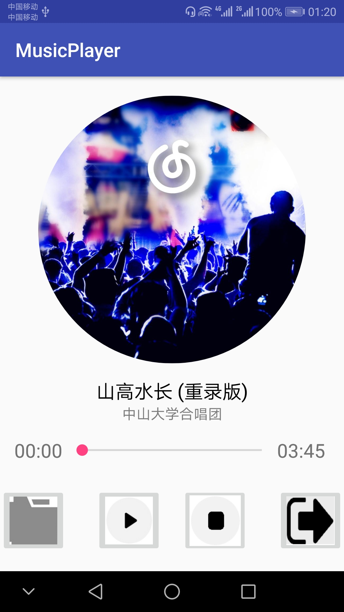
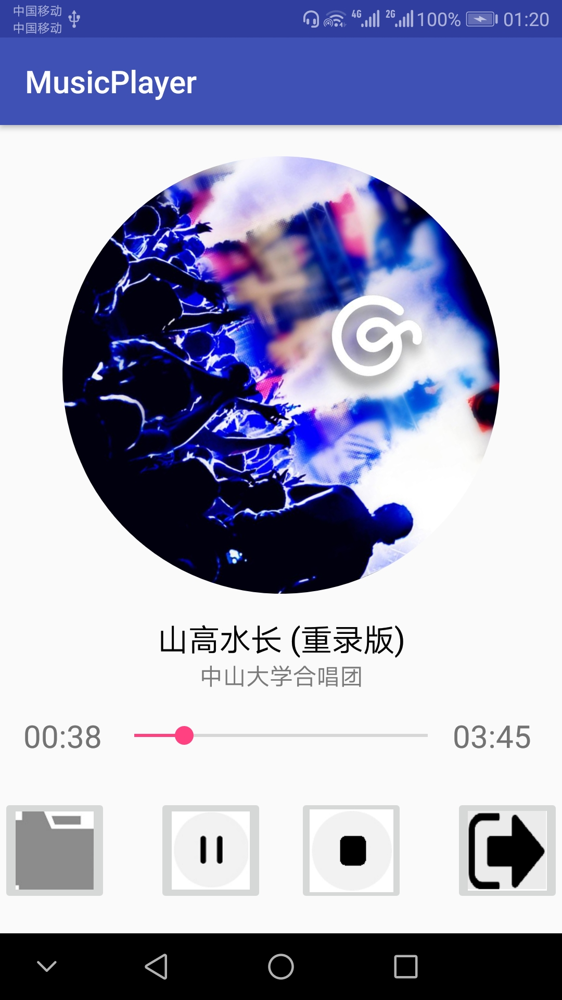
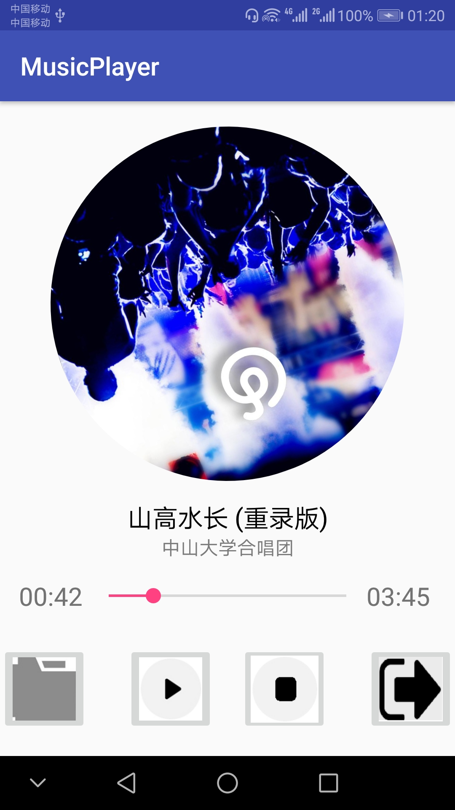
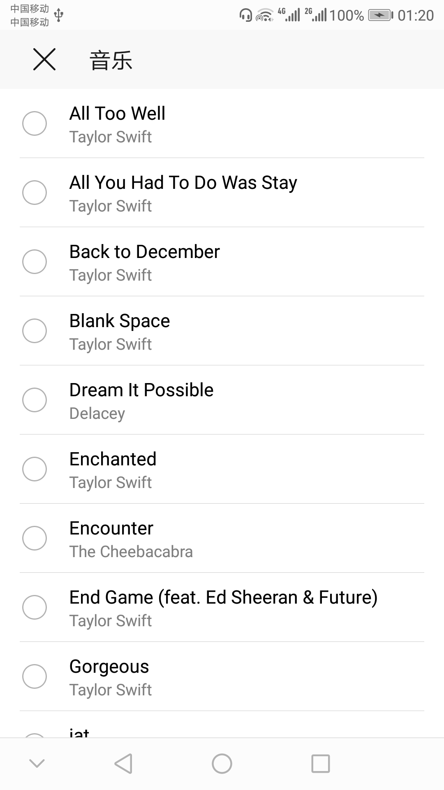
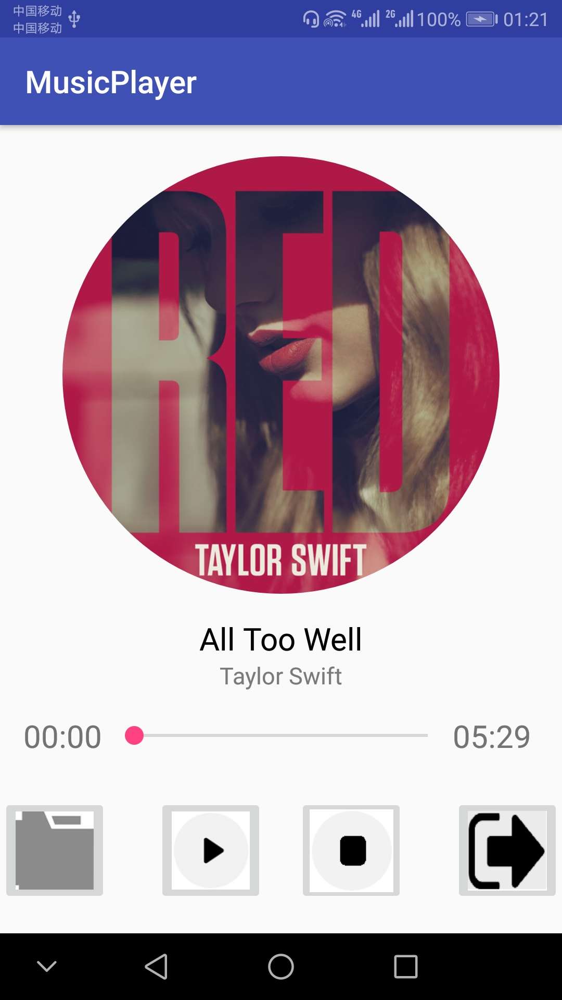

# 中山大学数据科学与计算机学院本科生实验报告
## （2018年秋季学期）
| 课程名称 | 手机平台应用开发 | 任课老师 | 郑贵锋 |
| :------------: | :-------------: | :------------: | :-------------: |
| 年级 | 2016级 | 专业（方向） | 软件工程（电子政务） |
| 学号 | 16340146 | 姓名 | 刘冰清 |
| 电话 | 15989004511 | Email | 1459422733@qq.com |
| 开始日期 | 2018.11.21 | 完成日期 | 2018.11.27

---

## 一、实验题目
个人项目4  
简单音乐播放器  
第十二周任务  
简单音乐播放器  

---

## 二、实现内容
实现一个简单的播放器，要求功能有：  
<table>
    <tr>
        <td >打开程序主页面</td>
        <td >开始播放</td>
    </tr>
    <tr>
        <td >暂停</td>
        <td >停止</td>
    </tr>
</table>

1. 播放、暂停、停止、退出功能，按停止键会重置封面转角，进度条和播放按钮；按退出键将停止播放并退出程序
2. 后台播放功能，按手机的返回键和home键都不会停止播放，而是转入后台进行播放
3. 进度条显示播放进度、拖动进度条改变进度功能
4. 播放时图片旋转，显示当前播放时间功能，圆形图片的实现使用的是一个开源控件CircleImageView
5. 在保持上述原有的功能的情况下，使用rxJava代替Handler进行UI的更新。


**附加内容（加分项，加分项每项占10分）**

1.选歌

用户可以点击选歌按钮自己选择歌曲进行播放，要求换歌后不仅能正常实现上述的全部功能，还要求选歌成功后不自动播放，重置播放按钮，重置进度条，重置歌曲封面转动角度，最重要的一点：需要解析mp3文件，并更新封面图片。

---

## 三、实验结果
### (1)实验截图
1. 主界面

2. 开始播放

3. 暂停

4. 停止

5. 选择音频文件

6. 更换歌曲

  
### (2)实验步骤以及关键代码
1. UI设计，主要是使用CricleImage和SeekBar
```java
    <de.hdodenhof.circleimageview.CircleImageView
        xmlns:app="http://schemas.android.com/apk/res-auto"
        android:id="@+id/cover"
        android:layout_width="280dp"
        android:layout_height="280dp"
        android:src="@mipmap/img"
        app:civ_border_width="0dp"
        app:civ_border_color="#FF000000"
        android:layout_marginTop="20dp"
        app:layout_constraintLeft_toLeftOf="parent"
        app:layout_constraintRight_toRightOf="parent"
        app:layout_constraintTop_toTopOf="parent"/>
```
```java
        <SeekBar
            android:id="@+id/seekBar"
            android:layout_weight="4"
            android:layout_width="0dp"
            android:layout_height="wrap_content"
            android:layout_gravity="center_vertical"/>
```
2. 创建MusicService
```java
public MusicService() {
    try {
        if(mediaPlayer == null)
        {
            mediaPlayer = new MediaPlayer();
            mediaPath = Environment.getExternalStorageDirectory().getPath()+"/山高水长.mp3";
            mediaPlayer.setDataSource(mediaPath);
            mediaPlayer.prepare();
            mediaPlayer.setLooping(true);  // 设置循环播放
        }
    } catch (Exception e) {
        e.printStackTrace();
    }
    
```
3. CricleImage的旋转
```java
        animator = ObjectAnimator.ofFloat(cover,"rotation",0,360);
        animator.setDuration(15000);
        animator.setInterpolator(new LinearInterpolator());
        animator.setRepeatCount(Animation.INFINITE);
        animator.setRepeatMode(ValueAnimator.RESTART);
        animator.setCurrentPlayTime(ms.mediaPlayer.getCurrentPosition());
        if(MusicService.mediaPlayer.isPlaying()){
            play.setImageResource(R.mipmap.pause);
            animator.start();
        }
```
4. 播放和暂停的实现，利用Binder的onTransact函数
```java
        play.setOnClickListener(new View.OnClickListener() {
            @Override
            public void onClick(View v) {
                try {
                    ms.binder.onTransact(101, Parcel.obtain(), Parcel.obtain(), 0);
                } catch (RemoteException e) {
                    e.printStackTrace();
                }
                if (!isplaying) {
                    if(!animator.isStarted()){
                        animator.start();
                    }else{
                        animator.resume();
                    }
                    play.setImageResource(R.mipmap.pause);
                    isplaying = true;
                }
                else {
                    animator.pause();
                    play.setImageResource(R.mipmap.play);
                    isplaying = false;
                }

                handler.post(runnable);
            }
        });
```
Binder的onTransact函数,在MusicService类中重写:
```java
        @Override
        protected boolean onTransact(int code, Parcel data, Parcel reply, int flags) throws RemoteException {
            if (code == 101) {
                if (mediaPlayer.isPlaying()) {
                    mediaPlayer.pause();
                } else {
                    mediaPlayer.start();
                }
            }
            else if (code == 102) {
                if (mediaPlayer != null) {
                    mediaPlayer.stop();
                    try {
                        mediaPlayer.prepare();
                        mediaPlayer.seekTo(0);
                    } catch (Exception e) {
                        e.printStackTrace();
                    }
                }
            }
            else if (code == 103) {
                System.exit(0);
            }
            else if (code == 104) {
                data.setDataPosition(0);
                int process = data.readInt();
                mediaPlayer.seekTo(process);
            }
            else if (code == 105) {
                data.setDataPosition(0);
                String path = data.readString();
                if (path!=null) {
                    try {
                        mediaPlayer.reset();
                        mediaPlayer.setDataSource(path);
                        mediaPath = path;
                        mediaPlayer.prepare();
                    } catch (IOException e) {
                        e.printStackTrace();
                    }
                }
            }
            else if (code==106){
                mediaPlayer.pause();
            }
            return super.onTransact(code,data,reply, flags);
        }
    }

```
5. 停止播放的实现
```java
        stop.setOnClickListener(new View.OnClickListener() {
            @Override
            public void onClick(View v) {
                animator.end();
                isplaying = false;
                playingTime.setText("00:00");
                seekBar.setProgress(0);
                play.setImageResource(R.mipmap.play);
                try {
                    ms.binder.onTransact(102, Parcel.obtain(), Parcel.obtain(), 0);
                } catch (RemoteException e) {
                    e.printStackTrace();
                }
            }
        });
```
6. 定义Handler，在run函数中进行更新seekbar的进度
```java
    public Handler handler = new Handler();
    public Runnable runnable = new Runnable() {
        @Override
        public void run() {
            playingTime.setText(time.format(ms.mediaPlayer.getCurrentPosition()));
            seekBar.setProgress(ms.mediaPlayer.getCurrentPosition());
            seekBar.setOnSeekBarChangeListener(new SeekBar.OnSeekBarChangeListener() {
                @Override
                public void onProgressChanged(SeekBar seekBar, int progress, boolean fromUser) {
                    if (fromUser) {
                        ms.mediaPlayer.seekTo(seekBar.getProgress());
                    }
                }

                @Override
                public void onStartTrackingTouch(SeekBar seekBar) {

                }

                @Override
                public void onStopTrackingTouch(SeekBar seekBar) {

                }
            });
            handler.postDelayed(runnable, 100);
        }
    };
```
```java
handler.post(runnable);
```
7. 选择本地音频文件
```java
        file.setOnClickListener(new View.OnClickListener() {
            @Override
            public void onClick(View v) {
                play.setImageResource(R.mipmap.play);

                if (animator != null){
                    degree=(Float) animator.getAnimatedValue();
                    animator.cancel();
                }
                isplaying = false;
                try {
                    ms.binder.onTransact(106,Parcel.obtain(),Parcel.obtain(),0);
                } catch (RemoteException e) {
                    e.printStackTrace();
                }

                Intent intent = new Intent(Intent.ACTION_PICK, android.provider.MediaStore.Audio.Media.EXTERNAL_CONTENT_URI);
                startActivityForResult(intent, 1);
            }
        });
```

```java
    @Override
    protected void onActivityResult(int requestCode, int resultCode, Intent data) {
        if (resultCode == Activity.RESULT_OK) {
            Uri selectAudioUri = data.getData();
            String[] filePathColumn = {MediaStore.Audio.Media.DATA};
            Cursor cursor = getContentResolver().query(selectAudioUri,filePathColumn,null,null,null);
            cursor.moveToLast();
            String path = cursor.getString(cursor.getColumnIndex(filePathColumn[0]));
            cursor.close();

            if(path!=null){
                Parcel parcel=Parcel.obtain();
                parcel.writeString(path);
                try {
                    ms.binder.onTransact(105,parcel,Parcel.obtain(),0);
                } catch (RemoteException e) {
                    e.printStackTrace();
                }

                animator.end();
                isplaying = false;
                playingTime.setText("00:00");
                seekBar.setProgress(0);
                play.setImageResource(R.mipmap.play);

                setSongDetail(path);
            }
        }
    }
```
8. 解析mp3文件
```java
    private void setSongDetail(String path){
        MediaMetadataRetriever mmr = new MediaMetadataRetriever();
        mmr.setDataSource(path);
        String song_name = mmr.extractMetadata(MediaMetadataRetriever.METADATA_KEY_TITLE);
        String singer_name = mmr.extractMetadata(MediaMetadataRetriever.METADATA_KEY_ARTIST);

        byte[] data = mmr.getEmbeddedPicture();
        Bitmap bitmap = BitmapFactory.decodeByteArray(data, 0, data.length);
        cover.setImageBitmap(bitmap);

        name.setText(song_name);
        singer.setText(singer_name);

        totalTime.setText(time.format(ms.mediaPlayer.getDuration()));

        mmr.release();
    }
```
9. 在保持上述原有的功能的情况下，使用rxJava代替Handler进行UI的更新
```java
Observable.create(new Observable.OnSubscribe<Integer>() {
        @Override
        public void call(Subscriber<? super Integer> subscriber) {
            subscriber.onNext(ms.mediaPlayer.getCurrentPosition());
            subscriber.onCompleted();
        }
    })
    .subscribeOn(Schedulers.io())
    .observeOn(AndroidSchedulers.mainThread())
    .subscribe(new Observer<Integer>() {
        @Override
        public void onNext(Integer s) {
            playingTime.setText(time.format(s));
            seekBar.setProgress(s);
            seekBar.setOnSeekBarChangeListener(new SeekBar.OnSeekBarChangeListener() {
                @Override
                public void onProgressChanged(SeekBar seekBar, int progress, boolean fromUser) {
                    if (fromUser) {
                        ms.mediaPlayer.seekTo(seekBar.getProgress());
                    }
                }

                @Override
                public void onStartTrackingTouch(SeekBar seekBar) {

                }

                @Override
                public void onStopTrackingTouch(SeekBar seekBar) {

                }
            });
        }
        
        @Override
        public void onCompleted() {

        }

        @Override
        public void onError(Throwable e) {

        }
    });
    }
```
  
### (3)实验遇到的困难以及解决思路
  1. 找不到本地存储的山高水长.mp3文件。我是使用自己手机进行调试，并且手机没有外置SD卡。由于我在手机上看到这个文件的位置是处于内部存储这样的路径下，于是查找博客发现获取内部存储路径需要使用`Environment.getDirectory()`函数，但是一直显示这样不正确。后面继续查找资料，发现手机上显示的内部存储并非这个函数所指的内部存储，正确的函数应该是`Environment.getExternalStorageDirectory()`。
  2. 后台播放后图片旋转的问题。图片旋转需要使用ObjectAnimator实现。一开始对这个类了解不够，导致图片旋转的效果十分奇怪，并且在看了demo之后才发现在后台播放后，图片不是从初始位置重新开始旋转的。并且我一开始将ObjectAnimator也放到了MusicServce类里面，但是后面发现并没有这个必要。
  3. 选择新的歌曲后台播放后，再次打开界面，歌曲的封面、名字、歌手信息都变成了一开始的山高水长.mp3文件的信息。后面通过设置断点，发现重新打开主界面后，MusicServce类会再次调用构造函数，使路径变回去。在构造函数中加入对MediaPlayer是否为空的判断即可。
  
---

## 四、实验思考及感想
1. 选择本地歌曲并播放。此过程中，首先点击file图片，通过intent去本地选择歌曲。然后通过重写onActivityResult函数获取图片的路径，并用利用这个路径获取音频文件。最后更新界面的封面、名字、歌手、歌曲长度等信息。
2. 本次实验使用了多线程和Service等功能，实现一个简单的音乐播放器。由于首次接触这些功能，掌握不熟练，本次实验比较有难度。同时通过本次实验，我们也更深入的了解了多线程的工作和Service与Activity的交互等技能。
3. 使用rxJava代替Handler。参考链接中，作者说Android 创造的 AsyncTask 和Handler ，其实都是为了让异步代码更加简洁。RxJava 的优势也是简洁，但它的简洁的与众不同之处在于，随着程序逻辑变得越来越复杂，它依然能够保持简洁。在本次实验中，大概是因为逻辑较为简单，我倒是没怎么体会到这个优势，感觉两种方法差别不大。

---


