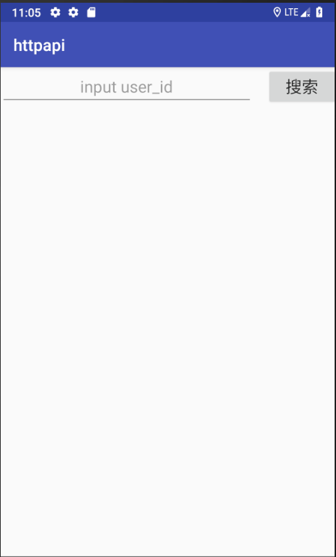
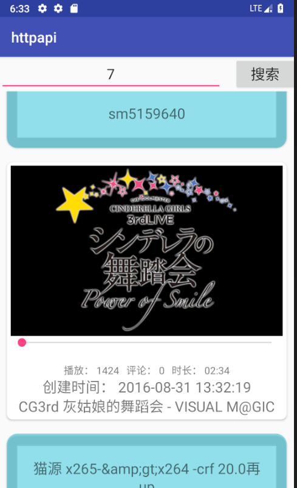
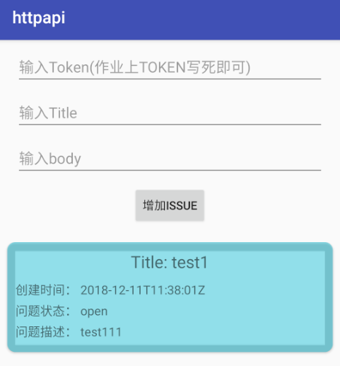
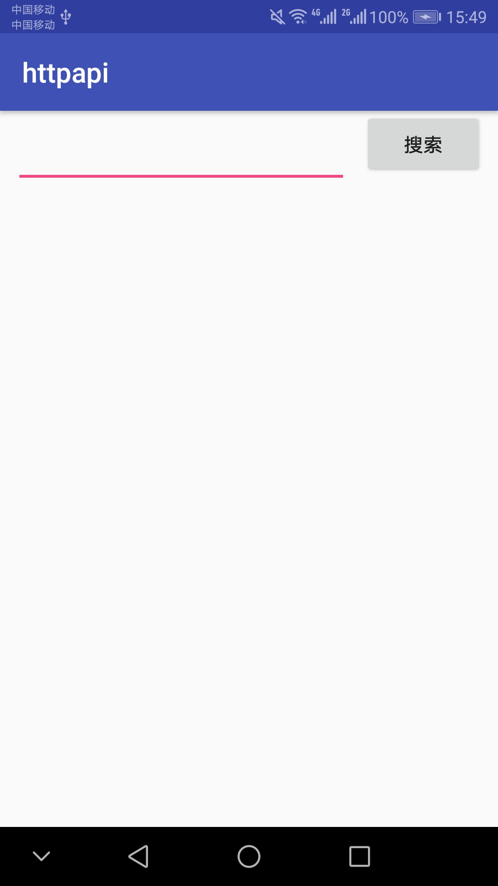
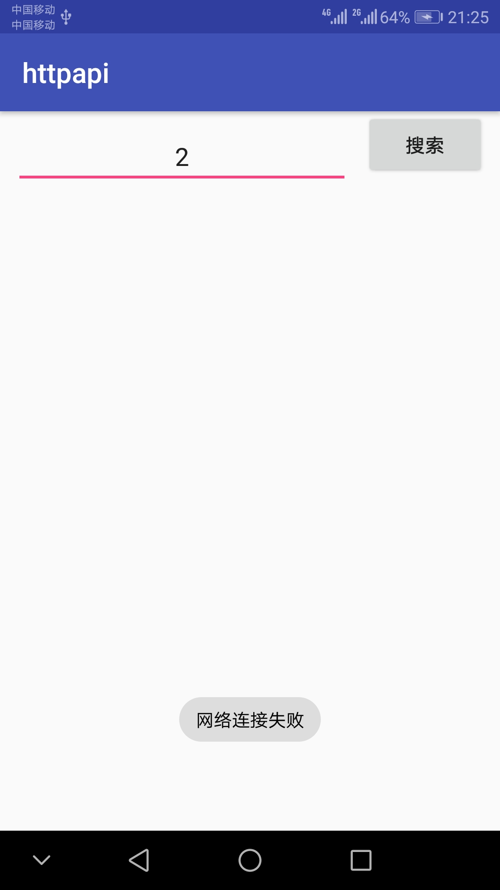

# 中山大学数据科学与计算机学院本科生实验报告
## （2018年秋季学期）
| 课程名称 | 手机平台应用开发 | 任课老师 | 郑贵锋 |
| :------------: | :-------------: | :------------: | :-------------: |
| 年级 | 2016级 | 专业（方向） | 软件工程（电子政务） |
| 学号 | 16340146 | 姓名 | 刘冰清 |
| 电话 | 15989004511 | Email | 1459422733@qq.com |
| 开始日期 | 2018.12.5 | 完成日期 | 2018.12.19

---

## 一、实验题目
个人项目5  
WEB API  
  
### 第十四周任务  
WEB API  

### 第十五周任务
实现一个github用户repos以及issues应用

---

## 二、实现内容
### 第十四周任务  
#### 实现一个bilibili的用户视频信息获取软件
<table>
    <tr>
        <td >打开程序主页面</td>
        <td >输入用户id，要求正整数int类型，不满足的弹Toast提示即可</td>
    </tr>
    <tr>
        <td >输入用户id，点击搜索，网络没打开则弹Toast提示网络连接失败</td>
        <td >网络打开情况下，输入用户id，不存在相应数据的弹Toast提示</td>
    </tr>
    <tr>
        <td >输入用户id = 2，点击搜索，展示图片/播放数/评论/时长/创建时间/标题/简介内容</td>
        <td >再次输入用户id = 7，接着上次结果继续展示以上内容</td>
    </tr>
</table>

* 搜索框只允许正整数int类型，不符合的需要弹Toast提示
*  当手机处于飞行模式或关闭wifi和移动数据的网络连接时，需要弹Toast提示
*  由于bilibili的API返回状态有很多，这次我们特别的限制在以下几点
    * 基础信息API接口为： `https://space.bilibili.com/ajax/top/showTop?mid=<user_id>`
    * 图片信息API接口为基础信息API返回的URL，cover字段
    * 只针对前40的用户id进行处理，即`user_id <= 40`
    * [2,7,10,19,20,24,32]都存在数据，需要正确显示
* **在图片加载出来前需要有一个加载条，不要求与加载进度同步**
* 布局和样式没有强制要求，只需要展示图片/播放数/评论/时长/创建时间/标题/简介的内容即可，可以自由发挥
* **布局需要使用到CardView和RecyclerView**
* 每个item最少使用2个CardView，布局怎样好看可以自由发挥，不发挥也行
* 不完成加分项的同学可以不显示SeekBar
* 输入框以及按钮需要一直处于顶部


### 第十五周任务
### 基础实验内容
#### 实现一个github用户repos以及issues应用
<table>
    <tr>
        <td >主界面有两个跳转按钮分别对应两次作业</td>
        <td >github界面，输入用户名搜索该用户所有可提交issue的repo，每个item可点击</td>
    </tr>
    <tr>
        <td >repo详情界面，显示该repo所有的issues</td>
        <td >加分项：在该用户的该repo下增加一条issue，输入title和body即可</td>
    </tr>
</table>

* 教程位于`./manual/tutorial_retrofit.md`
* 每次点击搜索按钮都会清空上次搜索结果再进行新一轮的搜索
* 获取repos时需要处理以下异常：HTTP 404 以及 用户没有任何repo
* 只显示 has_issues = true 的repo（即fork的他人的项目不会显示）
* repo显示的样式自由发挥，显示的内容可以自由增加（不能减少）
* repo的item可以点击跳转至下一界面
* 该repo不存在任何issue时需要弹Toast提示
* 不完成加分项的同学只需要显示所有issues即可，样式自由发挥，内容可以增加

### 加分项
* 加分项旨在学习Retrofit2的POST请求，加深Rest API的理解
* demo需要你们额外提供TOKEN参数，这点不必实现，实现了反而不利于检查
* 提交的代码可以删除掉你的token等授权信息
* 仅处理提交成功与提交失败两种状态
* issue提交成功后需要刷新展示出来
---

## 三、实验结果
### 第十四周任务
### (1)实验截图
1. 初始

2. 输入不是正整数int类型时

3. 数据库中不存在id

4. 网络连接失败

5. 搜索2

6. 搜索7

  
### (2)实验步骤以及关键代码
1. 建立主界面的UI，设置RecyclerView
```java
    <android.support.v4.widget.NestedScrollView
        android:layout_width="match_parent"
        android:layout_height="wrap_content"
        app:layout_constraintTop_toBottomOf="@id/linear" >

        <android.support.v7.widget.RecyclerView
            android:id="@+id/recyclerView"
            android:layout_width="match_parent"
            android:layout_height="wrap_content"
            android:layout_marginLeft="10dp"
            android:layout_marginRight="10dp"  />
    </android.support.v4.widget.NestedScrollView>
```
2. 实现每个item的UI
```java
<android.support.constraint.ConstraintLayout xmlns:android="http://schemas.android.com/apk/res/android"
    android:layout_width="match_parent"
    android:layout_height="wrap_content"
    android:layout_marginBottom="60dp"
    xmlns:app="http://schemas.android.com/apk/res-auto"
    xmlns:tools="http://schemas.android.com/tools">

    <android.support.v7.widget.CardView
        android:id="@+id/card1"
        app:cardCornerRadius="8dp"
        android:layout_width="match_parent"
        android:layout_height="wrap_content"
        android:layout_marginLeft="10dp"
        android:layout_marginRight="10dp"
        app:contentPadding="5dp"

        tools:targetApi="lollipop"
        android:clickable="true"
        app:cardUseCompatPadding="true"
        app:cardPreventCornerOverlap="false">
```
3. 输入不合法时弹出Toast提示
```java
            if(pattern.matcher(id).matches())
            {
                ...
            }
            else
            {
                Looper.prepare();
                Toast.makeText(MainActivity.this, "需要正整数类型数据", Toast.LENGTH_SHORT).show();
                Looper.loop();
            }

        }  catch (NumberFormatException e) {
            Looper.prepare();
            Toast.makeText(MainActivity.this, "需要正整数类型数据", Toast.LENGTH_SHORT).show();
            Looper.loop();
        }catch (Exception e) {
            Looper.prepare();
            Toast.makeText(MainActivity.this, "网络连接失败", Toast.LENGTH_SHORT).show();
            Looper.loop();
            e.printStackTrace();
        }
    }

```
4. 设置adapter
```java
public abstract class MyRecyclerViewAdapter<T> extends RecyclerView.Adapter<MyViewHolder> {
    private Context context;
    private int layoutId;
    private List<Map<String, Object>> data;
    private OnItemClickListener onItemClickListener = null;

    public MyRecyclerViewAdapter(Context _context, int _layoutId, List<Map<String, Object>> _data){
        context = _context;
        layoutId = _layoutId;
        data = _data;
    }

    @Override
    public MyViewHolder onCreateViewHolder(ViewGroup parent, int viewType) {
        MyViewHolder holder = MyViewHolder.get(context, parent, layoutId);
        return holder;
    }

    @Override
    public void onBindViewHolder(final MyViewHolder holder, int position) {

        convert(holder, data.get(position)); 
    }
```
5. 使用HttpURLConnection请求访问Web服务
```java
        search.setOnClickListener(new View.OnClickListener() {
            @Override
            public void onClick(View v) {
                new Thread() {
                    public void run() {
                        connection();
                    }
                }.start();
            }
        });
    }

    private void connection() {
        try {
            String str = "https://space.bilibili.com/ajax/top/showTop?mid=";
            String id = editText.getText().toString().trim();
            Pattern pattern = Pattern.compile("[0-9]*");
            Integer.parseInt(id);
            if(pattern.matcher(id).matches())
            {
                String path = str + id ;
                URL url = new URL(path);
                HttpURLConnection conn = (HttpURLConnection) url.openConnection();

                conn.setRequestMethod("GET");
                conn.setConnectTimeout(5000);
                int code = conn.getResponseCode();
                if (code == 200)
                {
                    InputStream inputStream = conn.getInputStream();

                    content = readStream(inputStream);
                    handler.post(runnableUi);
                }
            }
```
6. 获取结果转换成字符串
```java
    private String readStream(InputStream inputStream) throws Exception {
        //定义内存输出流
        ByteArrayOutputStream outStream = new ByteArrayOutputStream();
        //定义缓存区
        byte[] buffer = new byte[1024];
        int len = -1;
        while ((len = inputStream.read(buffer)) != -1) {
            outStream.write(buffer, 0, len);
        }
        inputStream.close();
        //把内存输入流读取到content中
        String c = new String(outStream.toByteArray());
        return c;
    }
```
7. 解析json数据
```java
   Runnable runnableUi = new Runnable() {
        @Override
        public void run() {
            try {
                JSONObject obj = new JSONObject(content);
                if(obj.getString("status").equals("false"))
                {
                    Toast.makeText(MainActivity.this, "数据库中不存在记录", Toast.LENGTH_SHORT).show();
                }
                else
                {
                    JSONObject jsonobj = obj.getJSONObject("data");
                    Map<String, Object> temp = new LinkedHashMap<>();
                    temp.put("cover", jsonobj.getString("cover"));
                    temp.put("title", jsonobj.getString("title"));
                    temp.put("content",jsonobj.getString("content"));
                    temp.put("duration",jsonobj.getString("duration"));
                    temp.put("play",jsonobj.getString("play"));
                    temp.put("create",jsonobj.getString("create"));
                    temp.put("video_review",jsonobj.getString("video_review"));
                    recyclelistdata.add(temp);
                    myAdapter.notifyDataSetChanged();
                    //myAdapter.addData(temp, myAdapter.getItemCount());
                }

            } catch (JSONException e) {
                e.printStackTrace();
            }
        }
    };
```
8. 重写convert，更新图片等UI
```java
        myAdapter = new MyRecyclerViewAdapter<Map<String, Object>>(MainActivity.this, R.layout.video_list, recyclelistdata) {
            @Override
            public void convert(MyViewHolder holder, Map<String, Object> s) {
                final ImageView image = holder.getView(R.id.image);
                TextView text1 = holder.getView(R.id.text1);
                TextView text2 = holder.getView(R.id.text2);
                TextView text3 = holder.getView(R.id.text3);
                TextView description = holder.getView(R.id.description);
                final ProgressBar progressBar = holder.getView(R.id.progressBar);

                final String cover = s.get("cover").toString();
                String title = s.get("title").toString();
                final String content = s.get("content").toString();
                String duration = s.get("duration").toString();
                String play = s.get("play").toString();
                String create = s.get("create").toString();
                String video_review = s.get("video_review").toString();

                text1.setText(title);
                text2.setText("播放：" + play + "  评论：" + video_review + "  时长：" + duration);
                text3.setText("创建时间：" + create);
                description.setText(content);

                @SuppressLint("HandlerLeak")
                final Handler handle = new Handler() {
                    public void handleMessage(Message msg) {
                        switch (msg.what) {
                            case 0: image.setImageBitmap((Bitmap) msg.obj);
                            break;
                            case 1: progressBar.setVisibility(View.INVISIBLE);

                        }
                        super.handleMessage(msg);
                    }
                };
                new Thread(new Runnable() {
                    @Override
                    public void run() {
                        try{
                            URL url = new URL(cover);
                            HttpURLConnection conn = (HttpURLConnection)url.openConnection();
                            conn.setDoInput(true);
                            conn.connect();
                            InputStream is = conn.getInputStream();
                            Bitmap bitmap = BitmapFactory.decodeStream(is);
                            Message msg = new Message();
                            msg.obj = bitmap;
                            msg.what = 0;
                            handle.sendMessage(msg);
                            Message msg2 = new Message();
                            msg2.what = 1;
                            handle.sendMessage(msg2);
                        }
                        catch (MalformedURLException e) {
                            e.printStackTrace();
                        } catch (IOException e) {
                            e.printStackTrace();
                        }
                    }
                }).start();

            }
        };
```
  
### (3)实验遇到的困难以及解决思路
1. 在联网的情况下status一直显示为false。一直无法加载出信息，直接用浏览器查看了一下情况，发现api接口中的user_id并不需要加上<>，比如id为2时，我之前的输入是mid=<2>，但是正确输入应该是mid=2。
2. 在子线程调用Toast报Can't create handler inside thread that has not called Looper.prepare() 错误。因为toast的实现需要在activity的主线程才能正常工作，所以传统的非主线程不能使toast显示在actvity上，通过Handler可以使自定义线程运行于UI主线程。解决方法是在toast外面加上`Looper.prepare()`和`Looper.loop()`。
3. 添加item后刷新，item之间的间距越来越大。我查找博客找到的都是关于decoration的设置问题，然而我并没有用decoration。后面发现可能是吧layout_height设成march_parent的问题，找了很久才找到是item整个页面的layout_height的问题。
4. item显示完全。博客上说的都是onCreateViewHolder里面的问题，但是我的函数并没有它们所说的问题。后面尝试在RecyclerView里面加layout_marginBottom，但是这样会直接导致页面无法更新。于是在item页面的最外层加这个，并且需要加的比较大。
---

### 第十五周任务
### (1)实验截图
  1. 开始界面

  2. 点击GITHUB按钮进入本次实验界面

  3. 无网络连接时

  4. 输入用户名搜索该用户所有可提交issue的repo

  5. 点击repo进入repo详情界面，显示该repo所有的issues

  6. 没有issue时

  7. 添加一条issue


### (2)实验步骤以及关键代码
  1. 主界面建立两个按钮分别对应两次作业
```java
    <Button
        android:id="@+id/btn1"
        android:layout_width="wrap_content"
        android:layout_height="wrap_content"
        android:text="BILIBILI"
        app:layout_constraintLeft_toLeftOf="parent"
        app:layout_constraintRight_toRightOf="parent"
        app:layout_constraintBottom_toTopOf="@id/btn2"/>


    <Button
        android:id="@+id/btn2"
        android:layout_width="wrap_content"
        android:layout_height="wrap_content"
        android:text="GITHUB"
        app:layout_constraintLeft_toLeftOf="parent"
        app:layout_constraintRight_toRightOf="parent"
        app:layout_constraintTop_toTopOf="parent"
        app:layout_constraintBottom_toBottomOf="parent"/>
```
  2. 设置点击两个按钮进入不同界面
```java
btn1.setOnClickListener(new View.OnClickListener() {
            @Override
            public void onClick(View v) {
                Intent intent1 = new Intent(MainActivity.this, BilibiliActivity.class);
                startActivityForResult(intent1, 1);
            }
        });


        btn2.setOnClickListener(new View.OnClickListener() {
            @Override
            public void onClick(View v) {
                Intent intent2 = new Intent(MainActivity.this, GithubActivity.class);
                startActivityForResult(intent2, 1);
            }
        });
```
  3. 设计GitHub的api测试界面和item界面
```java
    <android.support.v7.widget.CardView
        android:id="@+id/repo"
        app:cardCornerRadius="8dp"
        android:layout_width="match_parent"
        android:layout_height="wrap_content"
        android:layout_marginLeft="10dp"
        android:layout_marginRight="10dp"
        app:contentPadding="5dp"

        tools:targetApi="lollipop"
        app:cardUseCompatPadding="true"
        app:cardPreventCornerOverlap="false">

        <android.support.constraint.ConstraintLayout
            android:layout_width="match_parent"
            android:layout_height="wrap_content">

            <TextView
                android:id="@+id/reponame"
                android:layout_width="match_parent"
                android:layout_height="wrap_content"
                android:layout_marginTop="10dp"
                android:text="text1"
                android:textColor="#000000"
                android:textSize="20dp"
                android:textAlignment="center"/>

            <TextView
                android:id="@+id/repoid"
                android:layout_width="wrap_content"
                android:layout_height="wrap_content"
                app:layout_constraintTop_toBottomOf="@id/reponame"
                android:layout_marginTop="10dp"
                android:text="text2"
                android:textColor="#7a7a7a"
                android:textSize="15dp" />

            <TextView
                android:id="@+id/has"
                android:layout_width="wrap_content"
                android:layout_height="wrap_content"
                app:layout_constraintTop_toBottomOf="@id/repoid"
                android:layout_marginTop="10dp"
                android:text="text3"
                android:textColor="#7a7a7a"
                android:textSize="15dp" />

            <TextView
                android:id="@+id/repodes"
                android:layout_width="wrap_content"
                android:layout_height="wrap_content"
                app:layout_constraintTop_toBottomOf="@id/has"
                android:layout_marginTop="10dp"
                android:text="text3"
                android:textColor="#7a7a7a"
                android:textSize="15dp" />

        </android.support.constraint.ConstraintLayout>
    </android.support.v7.widget.CardView>
```
  4. 网络连接判断
```java
ConnectivityManager connectivityManager = (ConnectivityManager) GithubActivity.this
                        .getSystemService(Context.CONNECTIVITY_SERVICE);
                NetworkInfo networkInfo = connectivityManager.getActiveNetworkInfo();
                boolean flag = networkInfo != null && networkInfo.isConnected();
                if (!flag) {
                    Toast.makeText(GithubActivity.this, "网络连接失败", Toast.LENGTH_SHORT).show();
                    return;
                }
```
  5. 使用Rest + Retrofit2 + OkHttp请求用户名对应的repo
```java
OkHttpClient build = new OkHttpClient.Builder()
        .connectTimeout(2, TimeUnit.SECONDS)
        .readTimeout(2, TimeUnit.SECONDS)
        .writeTimeout(2, TimeUnit.SECONDS)
        .build();
Retrofit retrofit = new Retrofit.Builder()
        .baseUrl(baseURL) //设置网络请求的Url地址
        .addConverterFactory(GsonConverterFactory.create()) //设置数据解析器
        .addCallAdapterFactory(RxJavaCallAdapterFactory.create())
        .client(build)
        .build();
```
```java
    @GET("/users/{user_name}/repos")
    Observable<List<Repo>> getRepo(@Path("user_name") String user_name);
```
  6. 使用RxJava更新界面
```java
GitHubService request = retrofit.create(GitHubService.class);
request.getRepo(username)
        .subscribeOn(Schedulers.io())
        .observeOn(AndroidSchedulers.mainThread())
        .subscribe(new Observer<List<Repo>>() {
            @Override
            public void onNext(List<Repo> list) {
                list.removeIf(new Predicate<Repo>() {
                    @Override
                    public boolean test(Repo repoItem) {
                        return !repoItem.getHas_issues();
                    }
                });
                myAdapter.refresh(list);
                if (list.size() == 0) {
                    Toast.makeText(GithubActivity.this,
                            "该用户不存在可提交issue的项目", Toast.LENGTH_SHORT).show();
                }
            }

            @Override
            public void onError(Throwable e) {
                List<Repo> list = new ArrayList<>();
                myAdapter.refresh(list);
                Toast.makeText(GithubActivity.this,
                        "该用户不存在", Toast.LENGTH_SHORT).show();
            }

            @Override
            public void onCompleted() {

            }
        });
```
  7. 点击repo 的item进入repo详情界面
```java
        myAdapter.setOnItemClickListener(new MyRecyclerViewAdapter.OnItemClickListener() {
            @Override
            public void onClick(int position) {
                Intent intent = new Intent(GithubActivity.this, IssueActivity.class);
                Bundle bundle = new Bundle();
                Repo item = (Repo)myAdapter.getItem(position);
                bundle.putSerializable("repo_name", item.getName());
                bundle.putSerializable("user_name", item.getUserName());
                intent.putExtras(bundle);
                startActivityForResult(intent, 1);
            }
        });
```
  8. 显示该repo所有的issues
```java
        try {
            OkHttpClient build = new OkHttpClient.Builder()
                    .connectTimeout(2, TimeUnit.SECONDS)
                    .readTimeout(2, TimeUnit.SECONDS)
                    .writeTimeout(2, TimeUnit.SECONDS)
                    .build();
            Retrofit retrofit = new Retrofit.Builder()
                    .baseUrl(BASE_URL) //设置网络请求的Url地址
                    .addConverterFactory(GsonConverterFactory.create()) //设置数据解析器
                    .addCallAdapterFactory(RxJavaCallAdapterFactory.create())
                    .client(build)
                    .build();
            GitHubService request = retrofit.create(GitHubService.class);
            request.getIssue(user_name, repo_name)
                    .observeOn(AndroidSchedulers.mainThread())
                    .subscribeOn(Schedulers.io())
                    .subscribe(new Observer<List<Issue>>() {
                        @Override
                        public void onNext(List<Issue> list) {
                            myAdapter2.refresh(list);
                            if (list.size() == 0) {
                                Toast.makeText(IssueActivity.this,"这个项目没有issues", Toast.LENGTH_SHORT).show();
                            }
                        }

                        @Override
                        public void onError(Throwable e) {
                            List<Issue> list = new ArrayList<>();
                            myAdapter2.refresh(list);
                            Toast.makeText(IssueActivity.this,
                                    e.getMessage(), Toast.LENGTH_SHORT).show();
                        }

                        @Override
                        public void onCompleted() {

                        }
                    });
        }catch (Exception e) {
            e.printStackTrace();
        }
```
  9. 点击按钮添加issue
```java
addIssue.setOnClickListener(new View.OnClickListener() {
     @Override
     public void onClick(View v) {
         ConnectivityManager connectivityManager = (ConnectivityManager) IssueActivity.this.getSystemService(Context.CONNECTIVITY_SERVICE);
         NetworkInfo networkInfo = connectivityManager.getActiveNetworkInfo();
         boolean flag = networkInfo != null && networkInfo.isConnected();
         if (!flag)
         {
             Toast.makeText(IssueActivity.this, "网络连接失败", Toast.LENGTH_SHORT).show();
             return;
         }

         final String title = ((EditText)findViewById(R.id.issue_title_input)).getText().toString();
         final String body = ((EditText)findViewById(R.id.issue_body_input)).getText().toString();
         try {
             OkHttpClient build = new OkHttpClient.Builder()
                     .connectTimeout(2, TimeUnit.SECONDS)
                     .readTimeout(2, TimeUnit.SECONDS)
                     .writeTimeout(2, TimeUnit.SECONDS)
                     .build();
             Retrofit retrofit = new Retrofit.Builder()
                     .baseUrl(BASE_URL) //设置网络请求的Url地址
                     .addConverterFactory(GsonConverterFactory.create()) //设置数据解析器
                     .addCallAdapterFactory(RxJavaCallAdapterFactory.create())
                     .client(build)
                     .build();
             String message = new Gson().toJson(new PostMessage(title, body));
             RequestBody req_body = RequestBody.create(okhttp3.MediaType.parse("application/json;charset=utf-8"), message);
             GitHubService request = retrofit.create(GitHubService.class);
             request.postIssue(user_name, repo_name, req_body)
                     .observeOn(AndroidSchedulers.mainThread())
                     .subscribeOn(Schedulers.io())
                     .subscribe(new Observer<Issue>() {
                         @Override
                         public void onNext(Issue issue) {
                             Toast.makeText(IssueActivity.this, "提交issue成功", Toast.LENGTH_SHORT).show();
                         }

                         @Override
                         public void onError(Throwable e) {
                             Toast.makeText(IssueActivity.this, "提交issues失败："+e.getMessage(), Toast.LENGTH_SHORT).show();
                         }

                         @Override
                         public void onCompleted() {
                             getIssues();
                         }
                     });
         } catch (Exception e) {
             e.printStackTrace();
         }
     }
 });
```
```java
    @POST("/repos/{user_name}/{repo_name}/issues")
    Observable<Issue> postIssue(@Path("user_name") String user_name, @Path("repo_name") String repo_name, @Body RequestBody postMessage);
```
### (3)实验遇到的困难以及解决思路
1. 判断网络连接状态的问题。上周是使用HttpURLConnection请求访问Web服务，很容易判断出网络连接的问题，但是这周就需要自己提前判断。使用ConnectivityManager和NetworkInfo，并添加权限，就可以获得手机的网络状态了。
2. 点击搜索按钮闪退的问题。一开始以为是RxJava更新UI的部分出了问题，但是在此部分设置断点调试后，发现此部分应该并没有错。后来从头再检查了一次代码，发现是我将RecyclerView的id写错了。
3. 无法触发item的点击事件。点击item发现什么反应都没有，在GithubActivity和MyRecyclerViewAdapter里面item的OnClick事件中设置断点，发现这个函数根本没有被调用。后来再次检查java代码，并没有发现什么错误。推测可能是布局代码的问题，检查后发现是CardView里面多加了一行`clickable=“true”`，删掉这一行运行正常。
  
---

## 四、实验思考及感想
### 第十四周任务
 - toast的实现需要在activity的主线程才能正常工作。传统的非主线程不能使toast显示在actvity上。在toast外面加上`Looper.prepare()`和`Looper.loop()`可以解决这个问题。
 - 本次实验使用HttpURLConnection请求访问Web服务，通过API接口实现了网络数据的获取。在此过程中，我们需要熟练掌握多线程的使用和解析json数据。
 - 解析json时需考虑数据被[]和{}包裹的不同情况。
 
### 第十五周任务
#### 加分项：增加issue
 - 增加issue的实现需要使用@POST，过程比@GET难一些。需要创建RequestBody用于POST，然后还需要Token授权。关于GitHub API的调用，TA给的链接很有用：[一篇文章搞定Github API](https://segmentfault.com/a/1190000015144126?utm_source=tag-newest)
  
 #### 思考
  - 本次实验中，Rest + Retrofit2 + OkHttp + RxJava组合测试GitHub API，过程比较简便和易懂。
  - item里面的控件如果设置成可点击，会和item的点击事件冲突导致item的点击事件无法触发

---

